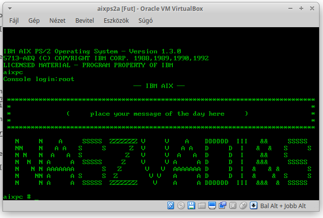

# AIX/PS2 part 1 - Retrohun blog

Some rights reserved! Vintage technology preserved.

---

[Previous](../philipspcl101reanim) | [Index](../../../../) | [Next](../toshibat3100fun)
--- | --- | ---

---

## What is it?
This is an intel i386+ port of the operating system [AIX](https://en.wikipedia.org/wiki/IBM_AIX#IBM_PS/2_series).
Originally supported only certain IBM PS/2 machines, then general AT386 support was added in last versions and updates (around v1.3)

## What virtual platforms support it?

- VirtualPC: since around 2010, screenshots around even on the previous Wikipedia URL
- Bochs: [since 2011](https://hup.hu/node/95061#comment-1222661)
- VirtualBox: I only checked turnkey images, boots at 1:1 speed, but works fine. See below

Networking: SLIP can be coonfigured in Bochs, and tested well around 2012.

## A good summary of the installation process
Was made by LGee: [sites.google.com/site/rhdisk0/unix/aix/aixps2](https://sites.google.com/site/rhdisk0/unix/aix/aixps2)

[Previous](../philipspcl101reanim) | [Index](../../../../) | [Next](../toshibat3100fun)
--- | --- | ---
