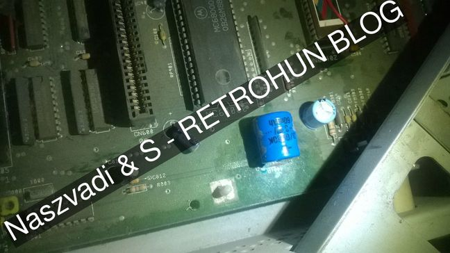
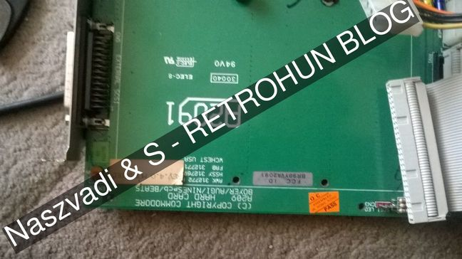
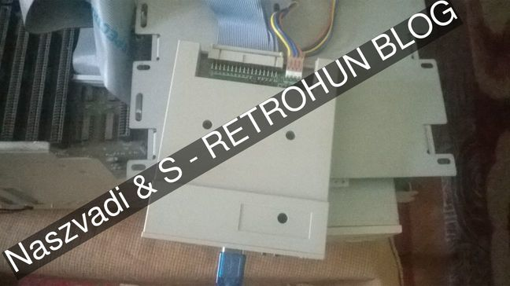
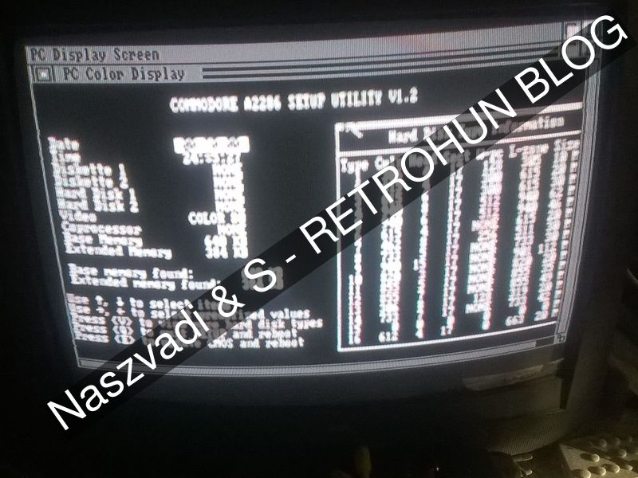
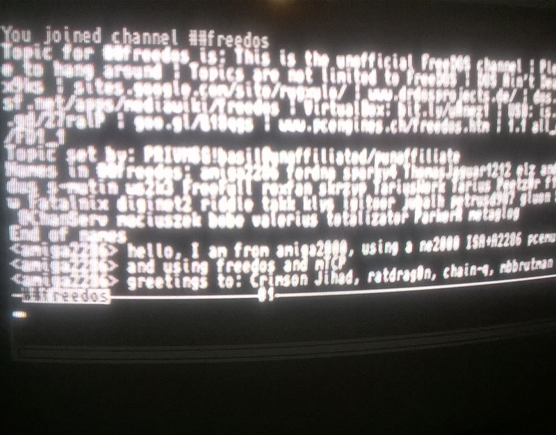
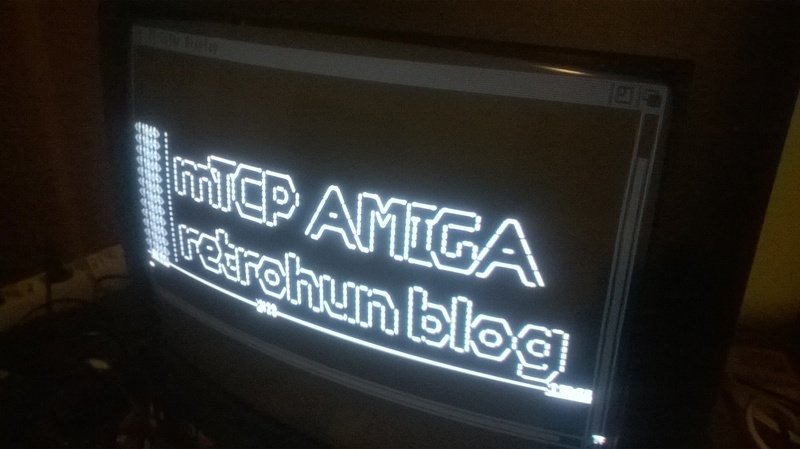

# Amiga 2000 et al - Retrohun blog

Some rights reserved! Vintage technology preserved.

---

[Previous](../xenix286ondemand) | [Index](../../../../) | [Next](../pcem14vsqnxdemo)
--- | --- | ---

---

## Without form and void
We own some m68000-based lifeforms since decade(s), but our first (and last?)
Amiga had been purchased around 2 years ago. So it was hardly time to try it out.
These paragraphs are not always in chronologically order! 

## The configuration
It is an Amiga 2000HD/1MB ram/KickStart3.1 upgraded, filled with an A2091 SCSI controller card with empty ramslots making it terribly slow, fed with a Gotek floppy emulator and an A2286 bridgeboard SBC card, of which the ISA slots can be used indirectly by the Amiga. Unfortunately, there is only one 16bit *free* ISA slot, which is reserved for the RTL8019AS jumpered version NE2000-clone.
The installation was straightforward due to the help of the #amigaspirit guys, thanks fly to LionSGI, Chain|Q, Ratman et al in no order and also not forgetting to mention [Crynwr.com](http://www.crynwr.com/drivers/) and [Brutman](http://www.brutman.com/mTCP/) for x86 packet drivers and for x86 TCP/IP applications that now the Amiga is internet-ready!

## First steps
Cleanup, motherboard battery check is done, removed after the shot.



A2091 card has a dead disk on it, after removing the storage, the card is beautiful:



The floppy emulator is in action:



## Installation
Got Workbench 1.3 on it - yes, together with KS3.1 -, the only trick was the installation of the bridgeboard often referred as codename "Janus". Must use latest Janus installation kit. Checksums for the curious, our Gotek supports only ADF raw format:

```
user@errorlevel:0:~/Downloads/amig**********.cx/install/to-adf$ for i in cksum md5sum;do echo "checksum type: '$i'"; $i CBM-AmigaJanus21-3683.*; done
checksum type: 'cksum'
3111503647 901120 CBM-AmigaJanus21-3683.adf
1100738325 286695 CBM-AmigaJanus21-3683.dms
checksum type: 'md5sum'
3b286b7fb0001ce4e05b75c586c290f4  CBM-AmigaJanus21-3683.adf
1f630e670e6a46a0045c3b6d3f6b50f3  CBM-AmigaJanus21-3683.dms
```

Of course jumpers must be set accordingly to the manuals available on the internet. For no reason we chose a virtual harddisk to use with the bridgeboard. There are more than one way to install operating system on Janus, from now. What we did is nothing but a qemu-system-i386 virtual machine FreeDOS installation with ISA ne2000 vNIC and mTCP applications on an ordinary modern peecee, without touching the amiga. In order to use virtual harddisks with Janus, its toolkit provides the MAKEAB utility, which has its own proprietary flat harddisk image format with a 512 bytes of header. A NASM source for creating an empty disk image:

```
;;;;;;;;;;;;;;;;;;;;;;;;;;;;;;;;;;;;;;;;;;;;;;;;;;;;;;;;;;
;; copyup/left/right/down by Naszvadi & S, thnx to Chain|Q
;;;;;;;;;;;;;;;;;;;;;;;;;;;;;;;;;;;;;;;;;;;;;;;;;;;;;;;;;;
numcylinders       equ 306
numheads           equ 2
numsectorspertrack equ 17

_start:

db 'ABOOT', 0, 0, 0
db (numheads >> 8), (numheads & 0ffh)
db (numsectorspertrack >> 8), (numsectorspertrack & 0ffh)
db (numcylinders >> 8), (numcylinders & 0ffh)

times 498 db 0f6h

%rep (numheads * numsectorspertrack * numcylinders)
times 512 db 0f6h
%endrep
;;;;;;;;;;;;;;;;;;;;;;;;;;;;;;;;;;;;;;;;;;;;;;;;;;;;;;;;;;
```

The C/H/S geometry that is used in real was 306/2/17, an 5MB vintage uncommon harddisk size. There is only one caveat at this process: seems that SBC bios is buggy, and must align the partitions' beginnings to cylinder boundary - assignments are heads:=1 AND spt:=0, which means "0 modulo cylinders" basically. See the final results in action:







## Corollary
There is a new [FreeDOS](http://www.freedos.org/) platform also with a new mTCP platform - despite reported by Mike recalling his memories, mTCP had already been tested with Janus successfully almost a decade ago, but hey, this is the first time for a real physical storage-less installation of Janus from scratch!
For the rest, I also made some patches to [Hampa Hug's pce-ibmpc emulator](http://hampa.ch/pce), added correctly(?) the MAKEAB vhd format, tested well, but our changes are unmerged yet. Being somewhat irrelevant, I also extended pce-ibmpc PCM tape support with custom sampling integer frequencies that must divide 44100Hz due to my incompetence :P :) 

---

[Previous](../xenix286ondemand) | [Index](../../../../) | [Next](../pcem14vsqnxdemo)
--- | --- | ---
