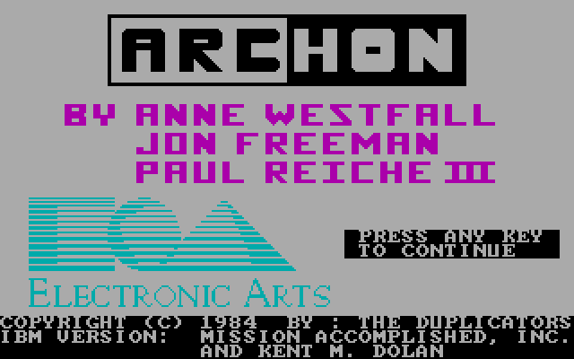
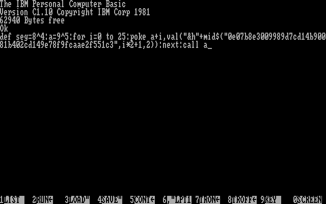

# Booting from COM1 - part 2

Some rights reserved! Vintage technology preserved.

---

[Previous](../bootingfromcom1) | [Index](../../../../) | [Next]
--- | --- | ---

---

## Converted two games
They have both DOS and booter versions, but basically they are same, just like in Galaxian's case. These games are:

- Archon
- Boulder Dash 1 (pc version)

## Optimized the basic loader code part
Instead of DATA statement, the whole assembly routine should be stored as a string instead. It needs less typing.

### Boulder Dash 1 specific remarks
Just enter the following code for Boulder Dash 1:

```
DEF SEG=8^4:A=9^5:FOR I=0 TO 25:POKE A+I,VAL("&h"+MID$("0e07b8e3009989d7cd14b90081b402cd149e78f9fcaae2f551c3",I*2+1,2)):NEXT:CALL A
```

Explanation:

- Destination segment is fixed to 4096 (1000h)
- - converted from .EXE version, and it has two relocate entries, so evaluated to 1000h
- Setting "A" to 59049: this is rather short, this has enough space to load most onesegment booter games & apps
- The string argument of "MID$()" is a hexdump, in which the first occurrence of /b9/ substring is the "MOV CX, imm16"; The total length word of loadable immediately follows the 0b9h value in little endian order (0h 81h in our case)
- Due to the segment biasing, after starting the program, the segment registers are incremented with 10h by the original code, so 128kbytes for RAM won't be enough! This can be improved, of course.

The loadable part got a 256 byte prefix in order to set up registers specifically for the application. Header source will be published later.

### Archon-related remarks
Got a specific header as BD1, and of course a slightly different basic loader:

```
DEF SEG=2560:A=9^5:FOR I=0 TO 25:POKE A+I,VAL("&h"+MID$("0e07b8e3009989d7cd14b900B0b402cd149e78f9fcaae2f551c3",I*2+1,2)):NEXT:CALL A
```

Com loader part's source code is also published here, links are in this blog entry, at the end.

## Screenshots

Archon IBM PC on XT:



ROM BASIC part - Boulder Dash loader (-: you have to type it at every boot :-):



Boulder Dash booted from COM1:


## Stuff

- [archon.com](archon.com)
- [boulder.bin](boulder.bin)
- [combinheader](combinheader)
- [combinheader.asm](combinheader.asm)
- [pce-5160-archon.sh](pce-5160-archon.sh)
- [pce-5160-boulder1.sh](pce-5160-boulder1.sh)

If one wanted to run these in pce, would obtain ibm xt and ibm rom basic rom images.

 md5 checksum                     | filename
----------------------------------|----------------------
 eb28f0e8d3f641f2b58a3677b3b998cc | ibm-basic-1.10.rom
 5a90f29a9658cffc9a79fd83f9bf2bf2 | ibm-xt-1982-11-08.rom

---

[Previous](../bootingfromcom1) | [Index](../../../../) | [Next]
--- | --- | ---
