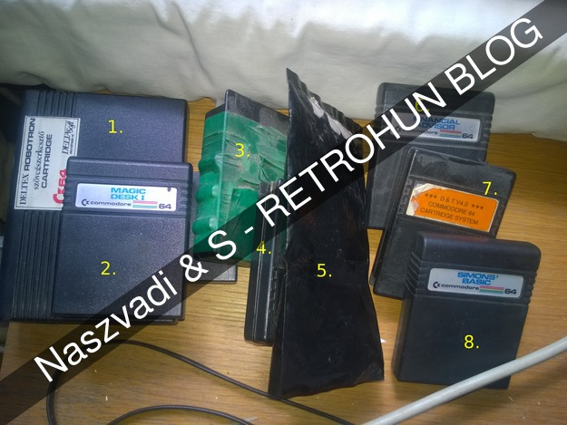

# C64 cartridge test drive

Some rights reserved! Vintage technology preserved.

---

[Previous](../cpmonc64) | [Index](../../../../) | [Next](../i8080emulatorupdate)
--- | --- | ---

---

There are some flat C64s floating around, planned for sale. Before
that I gave them a shot and tried out all cartridges we have. This
round, applications only. Numbered all on from 1 to 8 corresponding
to the following figure:

- 

The first is a Robotron Deltex "text editor" cartridge, developed in Hungary around
1988 or earlier due to the release date. It turns a c64 with storage (tape or
floppy unit) and with a supported printer to a line puffered text editor.

- 
- 

Magic Desk cartridge. No screenshots yet (forgot to capture), planned to be updated in
a future blog entry

- 

The first multi turbo cart denoted with order "3" on the group picture.
Seems that this is a bare 8k rom chip without any extra electronic widgets.
C64 does support 8kbytes of rom cart address range in memory, or even
16kbytes overlapping with basic's used memory area.

- 

A handy turbo cartridge with a simple extension - a hard reset button. It is
easy to wire out, a common extra feature is added to most cartridge by then.
Later models like c16, +4 etc. delivered a factory hardreset button.
On C64, it is basically just a short cut with a button between two pins of the
edge connector, maybe I was wrong but it is the 3rd and 5th pins paired.

Next multi turbo card is also a local breed having several utilities
compiled into. It occupies some chunks from the basic area, too, as it is seen
on the second screenshot after leaving menue via pressing space. Notice that
38911 - 30719 = 8192, exactly eight kbytes! Guessing that this could be a 16kbytes
standard rom using only supported address area.

- 
- 

This is a sealed, but naked cart without a chassis (maybe broken?) As far as
I remember, it came from one of the local flea market's bargain - disappointing
family again ;-) The bare cart needs to be protected from direct sunlight in order
to protect its rom contents. However launched without glitches:

- 

Financial advisor, if someone missed this:

- 

Yet another multi turboloader cartridge, manufactured by EPROM Bt., Hungary, ? BC:

- 

Simon's Basic rocks with its child-friendly syntax having support for
fancy graphic statements, easy to learn compared to C64's builtin basic.
Definiately a 10/10 to a newcomer by then.

- 
- 

The basic program itself was this:
```
10 HIRES 7,8
20 FOR I=0 TO 60 STEP 10
30 CIRCLE 100+I,40+I,70,90,1
40 NEXT I
200 WAIT 198,255
```

### Cuckoo-egg, testing a NEOS MS-30 mouse

It is good to know that it has two modes: its joystick mode can be forced
via pressing down left button when plugged in. Showed up the usual keyboard
triggers, seems to be okay. However, no application nearby to test with.

NEOS mouse is lying on an apple keyboard:

- 
- 

Attached mouse during tests:

- 

Planned to write some dedicated basic routines to test it not just ad-hoc
way like this, it is just a question of free time.

## Links

- [CP/M on C64](../cpmonc64)
- [c64-wiki.com/wiki/Cartridge](https://www.c64-wiki.com/wiki/Cartridge)

Have fun!

---

[Previous](../cpmonc64) | [Index](../../../../) | [Next](../i8080emulatorupdate)
--- | --- | ---
