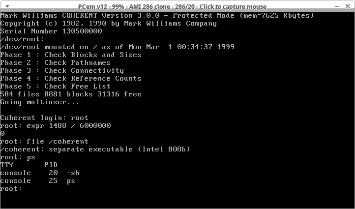
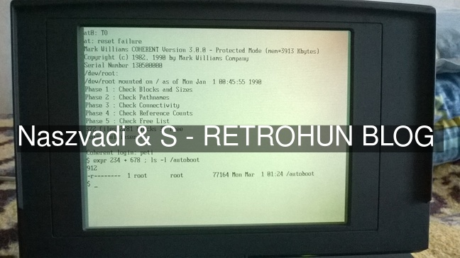

# Coherent 3.0 on 286 - Retrohun blog

Some rights reserved! Vintage technology preserved.

[Previous](../olivettim211vreanim) | [Index](../../../../) | Next
--- | --- | ---

## Mark Williams
There were several \*NIX ports and clones even for x86 architectures in the previous century. One company was MWC that made a clean-room implementation. What is extraordinary in this operating system that it worked on 80286 (till version 3.2) and v4.x is still used and maintained by enthusiasts despite the company closed in 1995.

## Ghosts n Stuff
On Udo\'s site - [www.autometer.de/unix4fun/coherent/ftp/distrib/Coherent-3.0/](http://www.autometer.de/unix4fun/coherent/ftp/distrib/Coherent-3.0/), there are some hints and install kits available. I chose 3.0 in order to install it on a virtual 286. Here is an example config file:
```
gameblaster = 0
gus = 0
si2001 = 0
voodoo = 0
model = 22
cpu_manufacturer = 0
cpu = 5
cpu_use_dynarec = 0
cpu_waitstates = 1
gfxcard = 14
video_speed = 0
sndcard = 0
cpu_speed = 5
has_fpu = 0
disc_a = 
disc_b = 
mem_size = 8192
cdrom_drive = 0
cdrom_enabled = 0
cdrom_channel = -1
cdrom_path = 
vid_resize = 0
vid_api = 0
video_fullscreen_scale = 0
video_fullscreen_first = 1
hdc_sectors = 615
hdc_heads = 4
hdc_cylinders = 17
hdc_fn = ./615_4_17.img
hdd_sectors = 0
hdd_heads = 0
hdd_cylinders = 0
hdd_fn = 
hde_sectors = 0
hde_heads = 0
hde_cylinders = 0
hde_fn = 
hdf_sectors = 0
hdf_heads = 0
hdf_cylinders = 0
hdf_fn = 
drive_a_type = 6
drive_b_type = 2
window_w = 0
window_h = 0
window_x = 0
window_y = 0
window_remember = 0
joystick_type = 0
mouse_type = 0
enable_sync = 0

[Joysticks]
joystick_0_nr = 0
 joystick_1_nr = 0'''
```

Note that the install media is in 5.25\" HD format, so installation could be tricky on other virtual platforms. Due to the free release of the sources, I dag in it for a while to create a custom serial number - which is _13050000_.

Compiled PCEM v\*12 from sources and used the config file above, the hard disc image was created with dd. Also created a 1440k floppy disc image in order to make a live-floppy distribution for 80286.

## Installation
Is pretty straightforward, feels like a next-next-finish method on other so-called operating systems.

Creating a 1.44M boot floppy was somewhat tricky. There are floppy/hard disk boot sectors/partition table codes in /conf folder after installation, and I don\'t know by heart but boot.fva or boot.fha were picked (one is for 1.2M, and the other is for 1.44M diskettes).

There are several good docs and QnAs around, which clarifies the correct order of dd-ing the boot sector, mkfs, fsck and copying the folders *and* patching the kernel on the destination floppy. Well, almost. The patching is needed to denote the correct root device major/minor numbers in it, which is different on hdd, on 1.44M fdd, or on other floppy formats! Needs modification of two variables, the hint was to find 4,15 pairs and replace them to 4,14. Or vica versa, one is 1.2M and the other is 1.44M.

PCEM is booting Coherent here:


## Caveats
Coherent 3.0 can support only a small number of HD controllers and disk sizes, so the live floppy IRL tested only on a diskless 80486 laptop:


## Reward
Is not cheese, download the floppy image from here: [coherent3live144.img](coherent3live144.img)

[Previous](../olivettim211vreanim) | [Index](../../../../) | Next
--- | --- | ---
