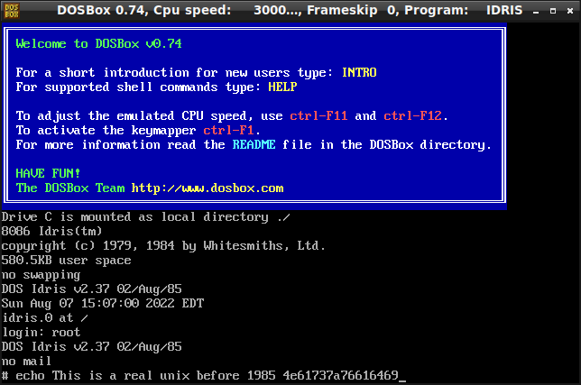
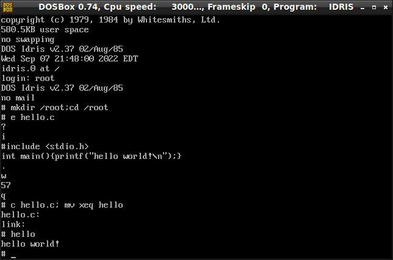

# CoIdris Fun

Some rights reserved! Vintage technology preserved.

---

[Previous](../sdk85funpart5) | [Index](../../../../) | [Next](../configsysgameandinfocom)
--- | --- | ---

---

## Dreams come true

Hopefully Freddy Krueger won't read my blog, otherwise lads floating around without suffering from insomnia would be in trouble.
An old wanted trophy is a rare unix port called Idris, for any platform - found somehow in the Summer. It is a rather extraordinary unix variant, especially its 8086 port called Co-Idris: it is launched from DOS, and also ab/using DOS ABI, namely all necessary filesystem calls! From CoIdris shell, "quit" command gets back to dos prompt and exits current unix session.

The turnkey VirtualBox image provided by others contains a well-populated loopback disk image. Despite it is very lightweight, provides a tiny c compiler and an ed-compatible text editor. One can start them via entering the corresponding one character commands!

## CoIdris test drive in DOSBox

First of all, we should get and extract necessary files! In a unixish shell environment can be done automatically. Assuming that wget, qemu and mtools installed:

```
wget -O- -q https://github.com/hansake/Whitesmiths-Idris-OS/raw/main/VirtualBox/co-idris_ms-dos.ova \
| tar -xvf - co-idris_ms-dos-disk001.vmdk
qemu-img convert -O raw co-idris_ms-dos-disk001.vmdk tmp.raw
mcopy -n -v -i tmp.raw@@32256 ::IDRIS.0 ::IDRIS.COM .
rm tmp.raw co-idris_ms-dos-disk001.vmdk
```

The CoIdris can be booted using a crafted DOSBox configuration file, which is also a syntactically incorrect but working [AUTOEXEC.BAT](AUTOEXEC.BAT) file. Then just launch DOSBox with the following command:

```
dosbox -conf AUTOEXEC.BAT
```

And the fancy cool login screen immediately pops up and starts the vintage operating system:

- 

A remark to c fans: the c compiler bundled in the image automatically links and creates a final binary executable named "xeq" in all cases, that's why I included a renaming after the compiler invocation, see below:

- 


### Rosetta cheat sheet for Idris CLI

| ***ix command | CoIdris command |
| ------------- | --------------- |
| ed FILENAME   | e FILENAME      |
| cc FILE.c     | c FILE.c        |
| shutdown      | quit            |
| ls            | ls              |
| mv            | mv              |
| cp            | cp              |
| rm            | rm              |
| mkdir         | mkdir           |

## Listing files

Idris DOS loader, disk image and autoexec.bat:

- [IDRIS.COM](IDRIS.COM)
- [IDRIS.0](IDRIS.0)
- [AUTOEXEC.BAT](AUTOEXEC.BAT)

## Related links

Covers short history, install kits, comprehensive scanned PDF documents and so on:

- [Idris (operating system) - Wikipedia](https://en.wikipedia.org/wiki/Idris_(operating_system))
- [github.com/hansake/Whitesmiths-Idris-OS](https://github.com/hansake/Whitesmiths-Idris-OS)
- [DOSBox](https://dosbox.com/)

## Have fun!

[Previous](../sdk85funpart5) | [Index](../../../../) | [Next](../configsysgameandinfocom)
--- | --- | ---
