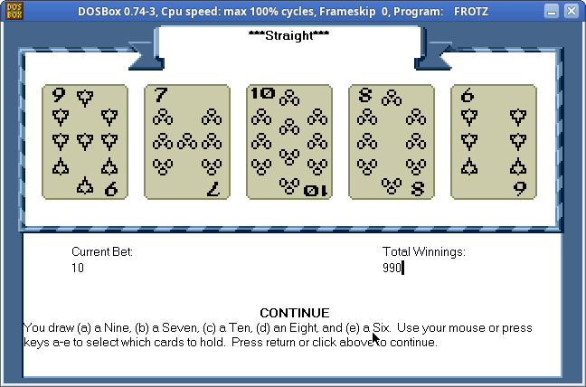

# Config.sys game and Infocom

Some rights reserved! Vintage technology preserved.

---

[Previous](../coidrisfun) | [Index](../../../../) | [Next](../i8080emulatorzorkless)
--- | --- | ---

---

## A totally useless hack ...

MS-DOS 6.22 config.sys has a weird syntax, with limited capabilities.
It supports multilevel submenues, which makes primitive definite games to
be implemented in it, like hexapawn. Player moves first what I uploaded.
You can try it in qemu like this:

```
qemu-system-i386 -net none -m 4 -fda configsysgame.img
```

If you a terminal fan - and trust in terminal fonts, size and layout - and
your latest qemu had been compiled with curses support, can run this game with curses:

```
qemu-system-i386 -net none -m 4 -fda configsysgame.img -display curses
```

Older qemu binaries might be called with different command line options in order
to set curses - e.g. "-curses".

The link to the disk image is at the end of this entry, usual flat 1.44M
floppy disk format, most x86 emulators can handle this.

The full source code is also attached as extracted from the disk image. Instead of
a screenshot, pasted from terminal:

```

 MS-DOS 6.22 Startup Menu
 ════════════════════════

     1. a2
     2. b2
     3. c2
     4. _
     5. _B | B | B
     6. ---+---+---
     7. _  |   |
     8. ---+---+---
     9. _W | W | W

  Enter a choice: 1


F5=Bypass startup files F8=Confirm each line of CONFIG.SYS and AUTOEXEC.BAT [N]
```

Probably it is the first game ever released for CONFIG.SYS...
other than MS-DOS ;-P

## Infocom test drive

Zork series, Adventure, Colossal Cave etc. these are vintage text mode interactive
fiction games, but there is a common thing: all of them had a version that
run in a platform-independent virtual machine, the so-called Z-machine.
It was a novel concept by Infocom game developer company in the late 1970s:
it is easier to write once a software for an imaginary virtual computer, and then
instead of porting products for different hardware architectures, only the
virtual machine has to be ported. So they released a Z-code interpreter with
their games.

Depending on the versions of the Z-machine "standard", it is quicly turned out
that it is capable for oldschool game developing, and not just specific IF ones.
For example: one released a snake nibbles clone, others a chess programme, or a
poker slot machine with graphics in Z-code v6 format (fmvpoker) and also there
is a robots clone called "zombies". The latter quickly became my favourite,
linux frotz interpreter dealed with it:

```
+-----------------------------------------------------------+ Directions:
|     Z   Z        Z Z       O                              |
|             O  O                     O                    | q w e
|                                                O          |  \|/
|                                                           | a-s-d
|                                                           |  /|\
|              O                O                           | z x c
|           O                                               |
|                                                           | Commands:
|    O                                                      |
|                                                           | s: sleep/wait
|                                                          Z| t: terminate/quit
|     O                                                     | r: redraw screen
|                                                           | b: beep off/on
|O                                                          |
|                                   O                       | Legend:
|                    O                                      |
|                                              O            | Z: zombie
|Z                                                          | O: pit
|                                               O          Z| @: you
|                           O                               |
|              O                       O       O            | Score: 0
|                               O         ZZ           Z @  | High:  0
+-----------------------------------------------------------+
```

Z-machine version 6 games are rare, and could be very picky on supported
Z-code interpreters, especially the next game, a great slot machine
videopoker. Needs Zork zero graphic files, careful reading of provided
textfile documentation, and the 32 bit djgpp version of DOSFrotz.



## Some snippets for Z-machine

As a hobbyist code-golfer, the Inform development system might be a new
platform. E.g. an unoptimized Fibonacci number printer up to 16 digits,
in an unobfuscated form:

```
[ Main a1 a2 a3 a4 b1 b2 b3 b4 c1 c2 c3 c4 i j;
  print "^Fibonacci numbers, all up to 16 digits:^";
  a4 = 1;
  for ( : a1 < 9999: ) {
    i = 0;
    if (a1>0) {
      print a1;
      i = 1;
    }
    if (i + a2 > 0) {
      for (j = 1000; i * j > a2; j = j / 10) {
        print 0;
      }
      print a2;
      i = 1;
    }
    if (i + a3 > 0) {
      for (j = 1000; i * j > a3; j = j / 10) {
        print 0;
      }
      print a3;
      i = 1;
    }
    for (j = 1000; i * j > a4; j = j / 10) {
      print 0;
    }
    print a4;
    print "^";
    c1 = a1;
    c2 = a2;
    c3 = a3;
    c4 = a4;
    a4 = a4 + b4;
    if (a4 > 9999) {
      a4 = a4 - 10000;
      a3++;
    }
    a3 = a3 + b3;
    if (a3 > 9999) {
      a3 = a3 - 10000;
      a2++;
    }
    a2 = a2 + b2;
    if (a2 > 9999) {
      a2 = a2 - 10000;
      a1++;
    }
    a1 = a1 + b1;
    b1 = c1;
    b2 = c2;
    b3 = c3;
    b4 = c4;
  }
];
```

Short explanation of (16 bit signed) integer variables:
a1..a4 and b1..b4 store the two numbers, a1 and b1 are LSW.
c1..c4 temporary variables for exchange, i denotes carry,
and finally j is an iterator for zero-padding - for a quick
and dirty poor man's printf "%04u" solution.

The Inform syntax and compiler stuff is well-documented, even
available in the most common package systems.

Compiled the Fibonacci lister with the following command line:

```
inform -v5 -ew~S~X~D \$MAX_ZCODE_SIZE=40000 longfibo.inf longfibo.z5
```

## Links

### Bundled goodies

- MS-DOS 6.22 config.sys game diskette image [configsysgame.img](./configsysgame.img)
- Source: Game in [CONGIG.SYS](./CONFIG.SYS)
- Fibonacci printer compiled to Z-machine [longfibo.z5](./longfibo.z5)
- Fibonacci printer source in Infocom format [longfibo.inf](./longfibo.inf)

### Others' github stuff

- [zombies game](https://github.com/jeffnyman/zifmia/blob/master/games/zombies.z5)
- [zombies source in infocom format](https://github.com/jeffnyman/zifmia/blob/master/games/zombies.inf)
- Hysteric^W his-toriq Z-code game sources:

```
git clone https://github.com/historicalsource/abyss.git
git clone https://github.com/historicalsource/amfv.git
git clone https://github.com/historicalsource/arthur.git
git clone https://github.com/historicalsource/ballyhoo.git
git clone https://github.com/historicalsource/beyondzork.git
git clone https://github.com/historicalsource/borderzone.git
git clone https://github.com/historicalsource/bureaucracy.git
git clone https://github.com/historicalsource/checkpoint.git
git clone https://github.com/historicalsource/cutthroats.git
git clone https://github.com/historicalsource/deadline.git
git clone https://github.com/historicalsource/enchanter.git
git clone https://github.com/historicalsource/hitchhikersguide.git
git clone https://github.com/historicalsource/hitchhikersguide-gold.git
git clone https://github.com/historicalsource/hollywoodhijinx.git
git clone https://github.com/historicalsource/infidel.git
git clone https://github.com/historicalsource/infocom-sampler.git
git clone https://github.com/historicalsource/journey.git
git clone https://github.com/historicalsource/leathergoddesses.git
git clone https://github.com/historicalsource/leathergoddesses-gold.git
git clone https://github.com/historicalsource/lurkinghorror.git
git clone https://github.com/historicalsource/minizork-1982.git
git clone https://github.com/historicalsource/minizork-1987.git
git clone https://github.com/historicalsource/minizork2-1988.git
git clone https://github.com/historicalsource/moonmist.git
git clone https://github.com/historicalsource/nordandbert.git
git clone https://github.com/historicalsource/planetfall.git
git clone https://github.com/historicalsource/planetfall-gold.git
git clone https://github.com/historicalsource/plunderedhearts.git
git clone https://github.com/historicalsource/restaurant.git
git clone https://github.com/historicalsource/seastalker.git
git clone https://github.com/historicalsource/sherlock.git
git clone https://github.com/historicalsource/shogun.git
git clone https://github.com/historicalsource/sorcerer.git
git clone https://github.com/historicalsource/spellbreaker.git
git clone https://github.com/historicalsource/starcross.git
git clone https://github.com/historicalsource/stationfall.git
git clone https://github.com/historicalsource/suspect.git
git clone https://github.com/historicalsource/suspended.git
git clone https://github.com/historicalsource/trinity.git
git clone https://github.com/historicalsource/wishbringer.git
git clone https://github.com/historicalsource/wishbringer-gold.git
git clone https://github.com/historicalsource/witness.git
git clone https://github.com/historicalsource/zork1.git
git clone https://github.com/historicalsource/zork1-gold.git
git clone https://github.com/historicalsource/zork2.git
git clone https://github.com/historicalsource/zork3.git
git clone https://github.com/historicalsource/zork-german.git
git clone https://github.com/historicalsource/zork.git
git clone https://github.com/historicalsource/zorkzero.git
```

### Everything else

- Interactive fiction archive: [Zcode games collection](https://ifarchive.org/indexes/if-archive/games/zcode/)
- Infocom: The Documentary [(review by Neozeed)](https://virtuallyfun.com/2021/04/21/infocom-the-documentary/)
- About Z-machine at [Wikipedia](https://en.wikipedia.org/wiki/Z-machine)

Have fun and Merry Christmas to you!

---

[Previous](../coidrisfun) | [Index](../../../../) | [Next](../i8080emulatorzorkless)
--- | --- | ---
