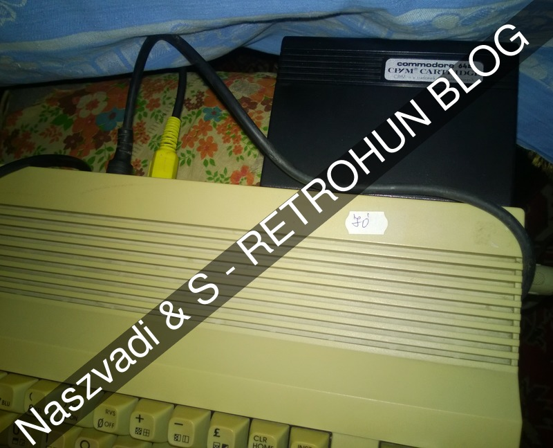
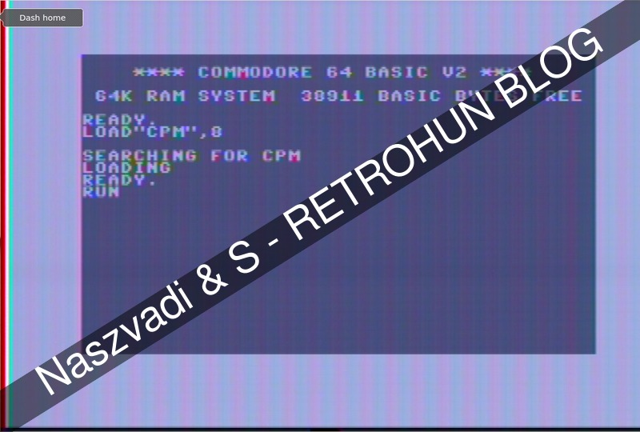
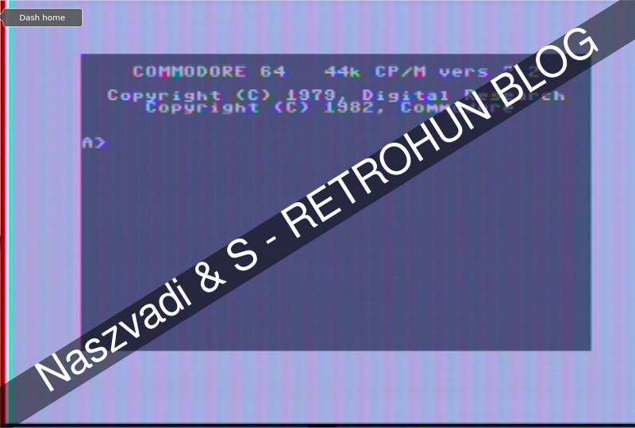
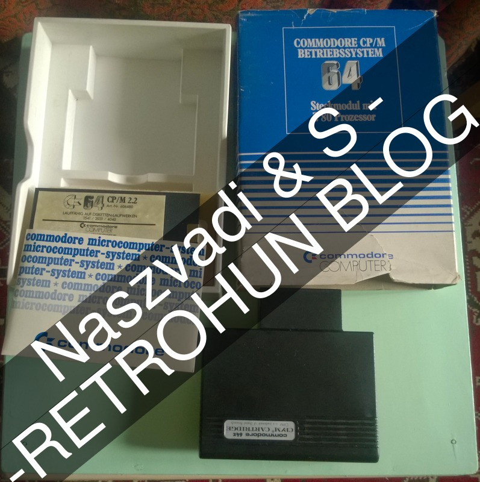
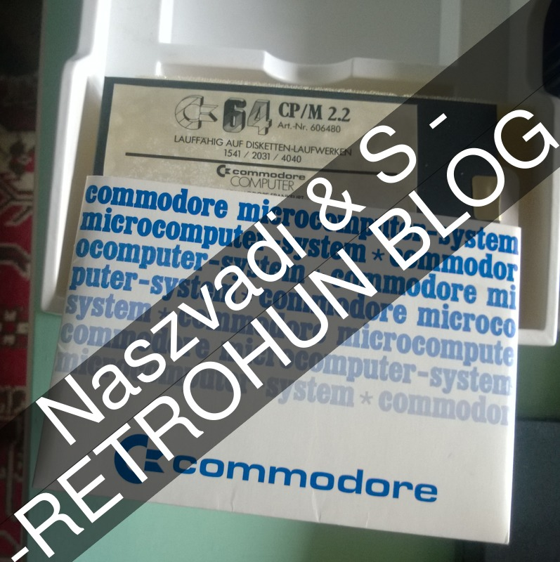
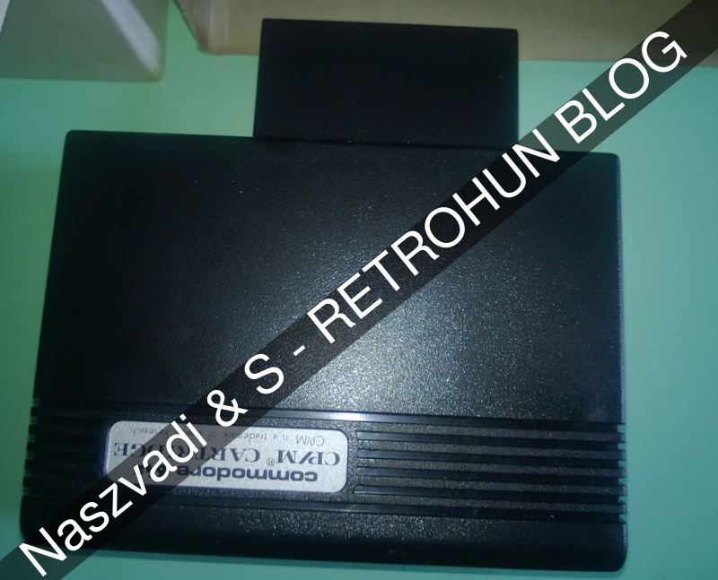

# CP/M on C64

Some rights reserved! Vintage technology preserved.

---

[Previous](../mindthexenix) | [Index](../../../../) | [Next](../c64cartridgetestdrive)
--- | --- | ---

---

## Booting the CP/M cartridge

It is widely known that most 8-bit architechtures mainly based on one of
these CPU-s or on their descendants and backward *software*-compatibles:

- MOS 6502
- Intel 8080

CBM (Commodore) used 6502, 6510 etc. in their 8 bit microcomputers,
especially 6510 in older breadbins and 8500 in newer C64 series like in
C64C. CP/M operating system is based in Intel's 8080, needs such a cpu or
at least a code-compatible, for which Zilog's Z80 is a perfect choice.
So Commodore released a special CP/M cartridge containing a Z80A bundled
with CP/M v2.2 OS tools/diskette crafted for this C64 version, and we gave
to our configuration a shot:

- 

Screenshots for the operation: Needed a C64, a diskette drive and the z80
cartridge with the cp/m diskette, of course. These were unearthed from one
of our stores.

```
LOAD"CPM",8
RUN
```
 
- 

After the asterisk progress bar finished, enjoy your CP/M prompt!

- 

These captures had been made on real hardware of course! Instead of using
a commodore monitor, a family friendly solution is used - a vintage p4
laptop with PCMCIA tuner card and its RCA input dumping with mplayer.

## Remarks

This CP/M solution delivered by CBM is fragile and full of bugs, suffering
from several limitations. CBM learned a lot when designed their C128 product
line, which was capable to boot CP/M while keeping C64-compatibily.
More stuff and info about this cartrdige is in the links section.

## Update

More pictures from the kit:

- 
- 
- 

## Related links

- [www.z80.eu/c64.html](http://www.z80.eu/c64.html)
- [CP/M on wikipedia](https://en.wikipedia.org/wiki/CP/M)
- [Running CP/M on the Commodore 64! on Virtuallyfun](https://virtuallyfun.com/wordpress/2018/07/27/running-cp-m-on-the-commodore-64/)

## Have fun!

[Previous](../mindthexenix) | [Index](../../../../) | [Next](../c64cartridgetestdrive)
--- | --- | ---
