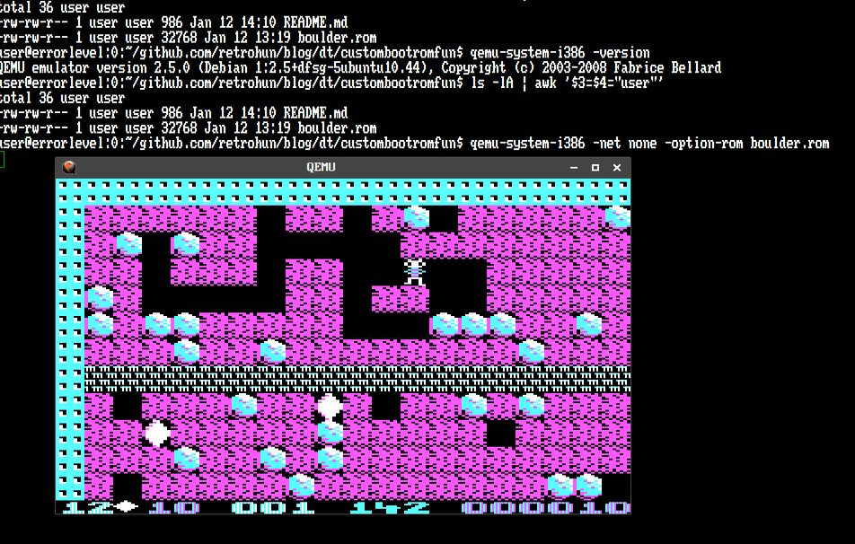

# Custom boot rom fun

Some rights reserved! Vintage technology preserved.

---

[Previous](../attunixfirsttry) | [Index](../../../../) | [Next](../sdk85funpart1)
--- | --- | ---

---

## How to avoid using *dos

It's simple: vintage ibm pc booter games can be converted to boot rom
image - eventually, just like in the following case. Had a little progress
in the last year due to well-known reasons, so it's showtime again!
Converted Boulder Dash ibm pc booter version to a 32k custom rom bios image.
The steps were plausible: Original image ripped from one of my previous
projects, see here: [Booting from COM1 - part 2](../bootingfromcom1part2);
and then splat into two parts: 200h (512) bytes of header and from beginning
offset 700h to the end. Those ranges are loaded by a newly developed loader
destination segment is a ram segment 1000h again as before. Before filling
destination segment with data, it is initialised with zeroes. After linking,
concatenating images, all 32k bytes inc. magic header must have 0 "checksum",
which means mod 256 zero sum of all bytes ignoring overflow, carry, whatever.
For the curious, this two^Woneliner could help determine what to add a byte to fix
rom checksum errors:

```
$ od -v -t u1 boulder.rom \
| awk '{for(i=1;i++<NF;){a+=$i}a%=256}END{printf"%x\n",(256-a)%256}'
```

## How to use it with qemu

In case is someone would try this out, open an xterm, then invoke qemu with
these options:

```
$ qemu-system-i386 -net none -option-rom boulder.rom
```

### See this in action

Bringing back memories from 1980s when playing nights with commodore 64

- 

## Downloadable stuff

Here you are:

- [boulder.rom](./boulder.rom)

Reminder: use space in menue, player controls are arrows and left shift.

## Have fun!

[Previous](../attunixfirsttry) | [Index](../../../../) | [Next](../sdk85funpart1)
--- | --- | ---
