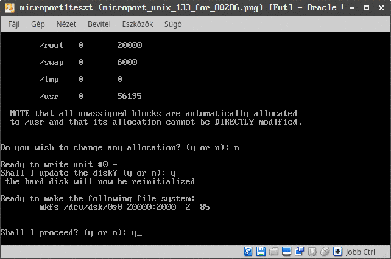

# Microport Unix on 286

Some rights reserved! Vintage technology preserved.

---

[Previous](../conway19372020) | [Index](../../../../) | [Next](../attunixfirsttry)
--- | --- | ---

---

## A clue about the oldest supported CPU

Several Microport Unix versions had been unearthed in the past from several online archives. Tried installer kits in [PCem] (https://pcem-emulator.co.uk/) and turned out that the earliest available version of the topic OS has a boot floppy that boots on a bare 80286 PC clone VM. So let's give it a shot!

## Preparing a VirtualBox VM

Beforehand installation, a caveat, a suspected bug that on vintage configuration pcem VMs: the cpu or the harddisk controllers does not accurate enough, possible lacking decent support of multibyte OUT cpu commands, so a little cheat had been performed: a flat image was created with Cylinder * Heads * 17 geometry, installed in VirtualBox, then converted to VMDK format and specified with hexa editor the correct CHS geometry instead of the "(non)standard 16 heads 63 sectors".

It is good to know for using floppy disk image with Virtualbox: the image file must have .img extension, and in order to set up a virtual 5.25" FDD, the following command line should be entered *after* adding a disk drive:

```
VBoxManage setextradata "XXX" VBoxInternal/Devices/i82078/0/LUN#0/Config/Type "Floppy 1.20"
```

Of course "XXX" must be replaced to the affected virtual machine's name or ID. Unless forcing the above settings, the previously added floppy disk unit will remain 1.44MB 3.5".

A 80286 can address only 16MB of RAM, this had been set in VM. No USB, no network card, no sharing, no virtualization support (guest lacks it totally, it is for a final i80286 configuration!)

### Installation media checksums

The following 3 disk images are mandatory for a minimal installation:

| md5sum   | cksum      | size    | common filename                      |
| -------- | ---------- | ------- | -------------------------------------|
| c130f93* | 2438273347 | 1228800 | 01 - System Diskette Boot Disk 1.img |
| a56898d* | 1475129059 | 1228800 | 02 - Runtime Disk 1.img              |
| b62fd5e* | 750847565  | 1228800 | 03 - Runtime Disk 2.img              |

It seems that during the installation process, the boot disk is being altered, the runtime images remained untouched.

## Screenshot gallery

Usual golden rule is to be followed: unselect any unnecessary fancy addons, press y/n+enter to the corresponding questions!

Checking hardware setup:

- 
- 

Starting installit - divvy labeling process and copy boot disk content; it is a little bit cheating, previously fdisk-ed and partitioned in other vm, starting interrogation from divvy part:

- 
- 
- 
- 
- 
- 
- 


"installit" further disks: runtime 1 and 2

- 
- 
- 
- 

Switches to runlevel 2 from now, root login without password by default is available!

- 
- 

awk and bc:

- 

### PCem v15 - 80286 based Commodore PC 30 III:

Converted the .VMDK image file to RAW, then booted in in PCem. Confirmed that an ancient x86 unix variant does have 80286 support!

- 
- 
- 

## Have fun!

[Previous](../conway19372020) | [Index](../../../../) | [Next](../attunixfirsttry)
--- | --- | ---
