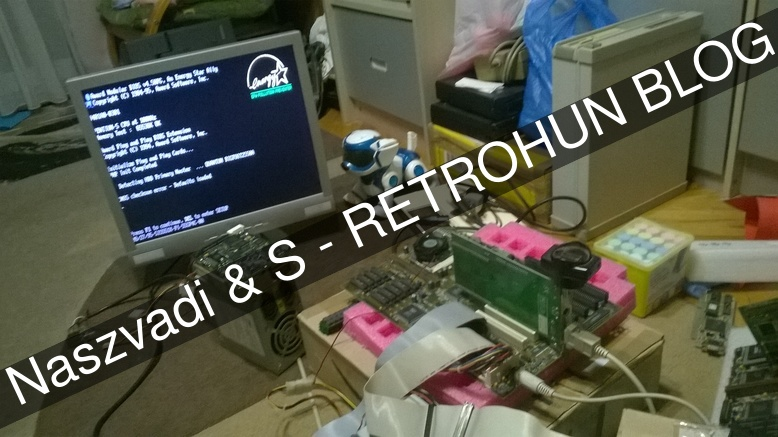
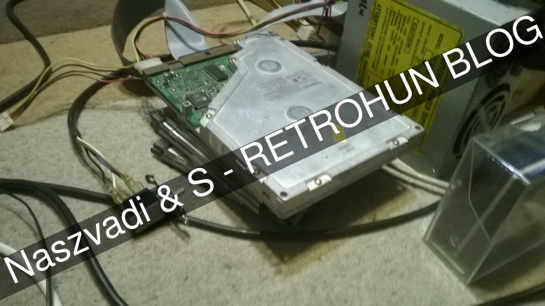
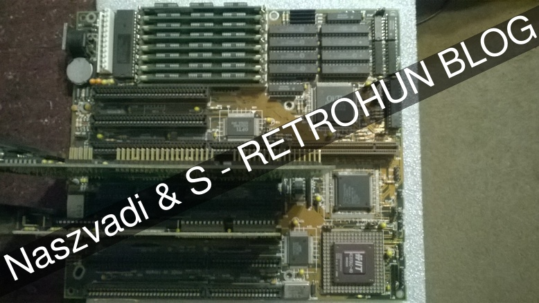
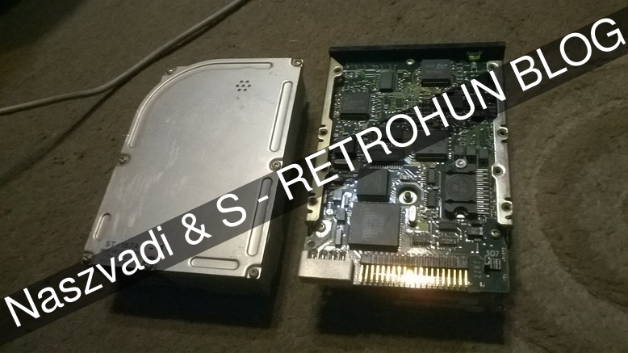
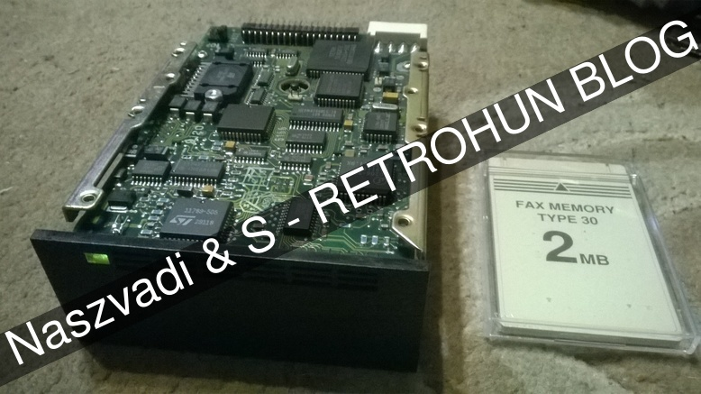
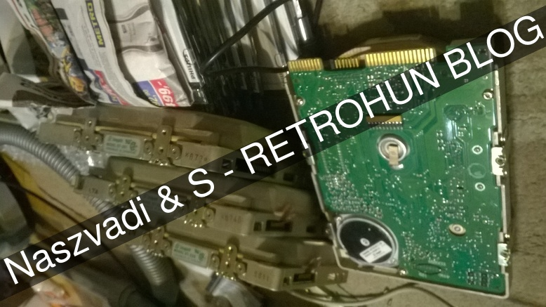
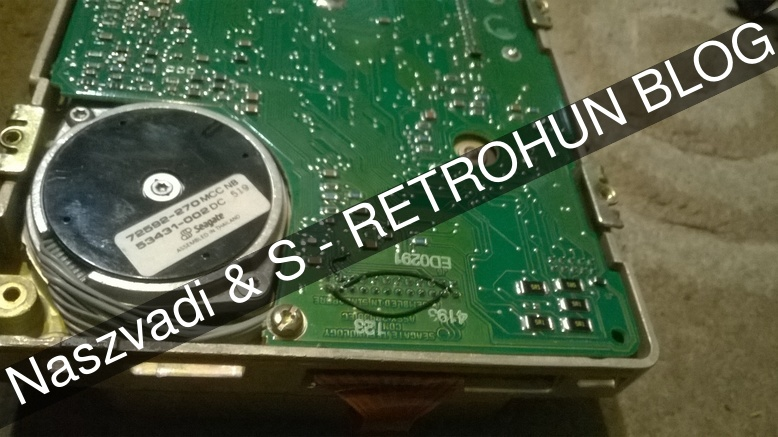

# Misc. hardware projects
Some rights reserved! Vintage technology preserved.

---

[Previous](../xenixtales) | [Index](../../../../) | [Next](../aixps2part2)
--- | --- | ---

---

## MoBos in the box

The other author of this blog did the rest of this post, focusing on repairing vintage ATA and MFM harddisks. First of all, a test configuration is required for our experiments, like a bare motherboard, keyboard, VGA and a PSU.
Most of the following gadgets had been purchased on local fleamarkets, including the tested motherboard, an ordinary PCI+ISA combo Socket7. In the background one might recognize an Olivetti M300-2 80286-based desktop pc is sleeping while lying on its edge - still works fine, but it is waiting for a fitting harddisk, which is kinda hard to find.

Actually, a spare 5.25" ATA ultrathin(!!) quantum bigfoot harddisk containing Windows 98 booted fine, the winchester itself in full glory:

The other mainboard for testing purposes was the following one with VESA local bus, a shot immediately was taken after powerchords'd been removed:

Full with 30 pin SIMM RAM, an ISA VGA and a 16 bit MFM controller were plugged in during disk testing sessions.

## Disk repairing results

- 2 Seagate ST-157A (IDE)
- 1 Seagate ST-251 MFM

### ST-157A siblings

Actually we've got one for ages, the other one is a new bargain. Originally they are coupled for a one-good-from-two-bad project, but surprisingly both were repaired successfully - hitting two birds with one stone :-) Details of replacing faulty mechanics will be detailed in another blogpost.

On the next picture, a PCMCIA memorycard is photobombing its big brother's portrait - the card unfortunately cannot be used as an amiga boot media. Basically I cannot resist these black IBM-style front covers, so shots were taken, here you are:

Despite having a label "DO NOT PERFORM LOWLEVEL FORMAT!", one of them needed and got it, it was purely a crossfingers situation - but it survived fortunately.

### ST-251 MFM soldering magic

This old beast was really a challenge to repair! The 0th track and the corresponding head damaged, was calling for some nasty tricks. After spinning tests - meaning booting the VLB board - produced some messages like "0 sector error", "C: drive error", "Hard disk failue" etc. corresponding to different diagnostic steps. Suspected a floating head on the plate meaning that no contiguous disk surface can be used hence it was unusable in that state. Our bad!

There are several solutions for disabling defective heads, the simple way is rewiring the head controller's stepper motor pins, plausible with some soldering sorcery. This solution also needs low level formatting with **modified geometry** before using it: the number of heads decremented to 5 (from the original value 6), so the new cylinder-heads-spt value are 820,5,17 respectively. And finally it worked as a charm!

Together with some cousins on the (trailing) edge:

Live long and prosper!

### ROM/SW tricks

It is mentioned by N. that there is not necessarily need to boot an operating system in order to launch low level formating menue on some MFM controller cards if one has IBM PC/XT/AT brand machine with ROM BASIC: a short BASIC oneliner can start the code laying on the 5th byte on most controllers' ROM segment, which is usually the LLF routine entry depending on the controller card's bios.

### Have fun!

Hope you enjoyed these stories!

Of course no warranty, no guarantee for success, no free beer etc., do this at your own risk, but do not try! (Yoda Ben Hur)

Needs deep hardware knowledge and experience, not for the newbies.

## Related links

- [STASON / SEAGATE: ST251-1 43MB 5.25"/HH MFM ST412 ](
  https://stason.org/TULARC/pc/hard-drives-hdd/seagate/ST251-1-43MB-5-25-HH-MFM-ST412.html )

---

[Previous](../xenixtales) | [Index](../../../../) | [Next](../aixps2part2)
--- | --- | ---
