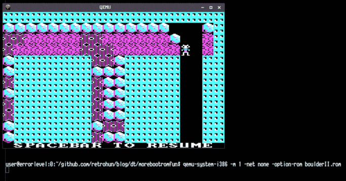

# More boot rom fun

Some rights reserved! Vintage technology preserved.

---

[Previous](../sdk85funpart4) | [Index](../../../../) | [Next]
--- | --- | ---

---

## A little progress

Recalling 198x: Boulder dash II had better levels, more challenging
compared to the initial version. We usually select the 5th level, which
is the strongest. However the PC version - with the same ugly CGA
2bit/pixel pinky palette - is above 32kB, so some tweaks were necessary
in order to fit it in a 32kB option rom image. The conversion steps were:

- convert .EXE file to flat binary .COM file
- test it in DOSBox
- write a custom COM-packer that only needs a 64kB segment
- test it in DOSBox again :-)
- convert packed .COM file to a 32kB rom bios image
- waste cca. 6-8 hours in weekend to find that DS init is missing from your code
- fix it
- test it with qemu

Remark: loading segment is 2000h, could be lower and also some .EXE header
fuzzing might allow to start it on machines with less than 512kB RAM.

- 

## Downloadable stuff

Feel free to disassemble it p.ex. with nasm's ndisasm:

- rom image [boulderII.rom](./boulderII.rom)

TO obtain a working FreeDOS .COM file, just extract it like this:

```
$ dd status=none if=boulderII.rom bs=1c skip=42 count=27482 of=BOULDER2.COM
```

## Have fun!

[Previous](../sdk85funpart4) | [Index](../../../../) | [Next]
--- | --- | ---
