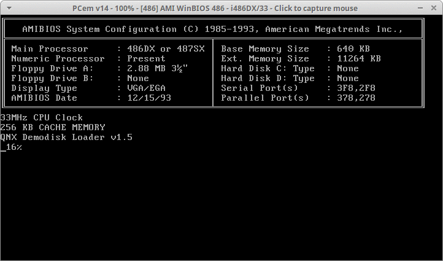
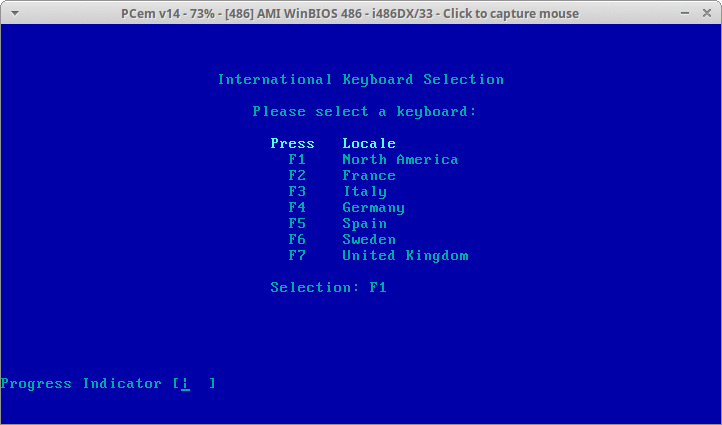
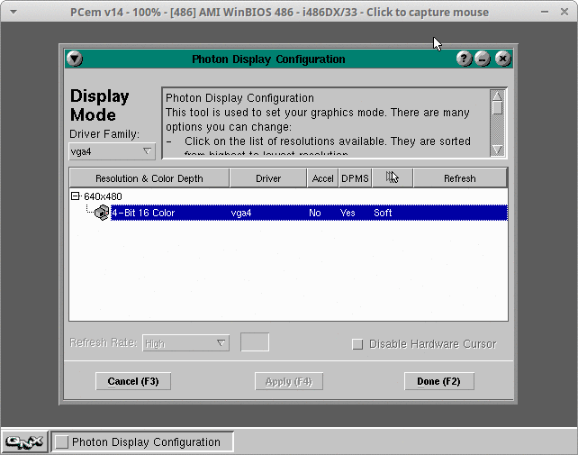
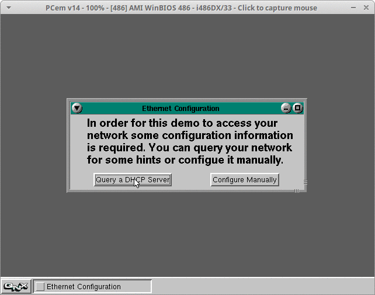
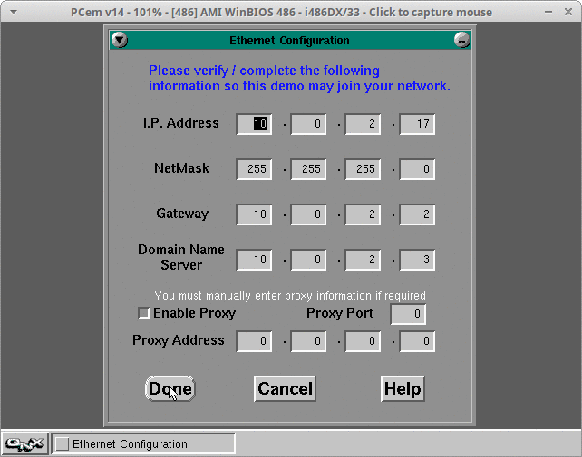
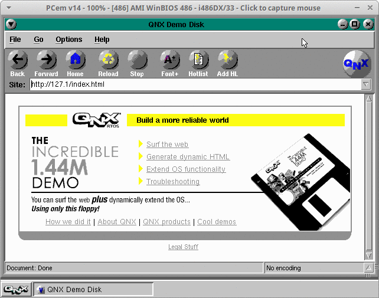
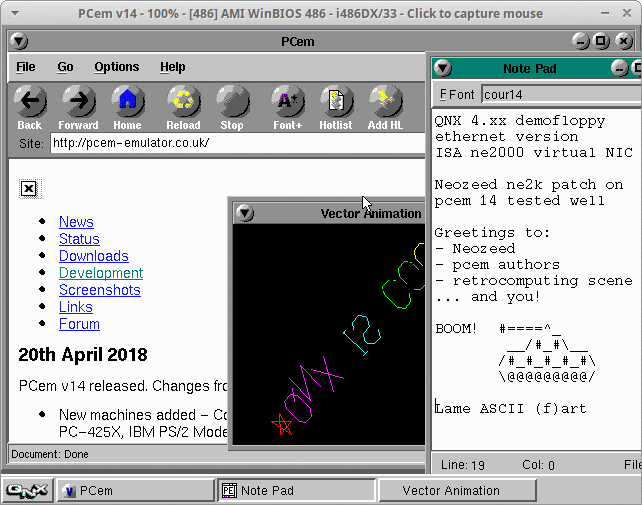

# Pcem 14 vs QNX demo
Some rights reserved! Vintage technology preserved.

---

[Previous](../amiga2000etal) | [Index](../../../../) | [Next](../orionadp2000info)
--- | --- | ---

---

## Ingredients
+ QNX demofloppy - the networked version (1440kbytes, md5sum: 48a1d1abf15c8d11d1c1dc946bb370e1, put to "$HOME"/.pcem/configs/qnxnet.img)
+ Pcem 14, build with NETWORKING support is a must, and a bios for a guest that supports NE2000ISA, preferably with winbios, in which mouse support can be tested before booting QNX

## Create a config file
With the provided GUI, then test it and manually assign the floppy relative path value to "disc_a" variable. Check then the file contents, it should be similar to this:
```
$ cat "${HOME}"/.pcem/configs/ne2000isa.cfg
gameblaster = 0
gus = 0
ssi2001 = 0
voodoo = 0
model = win486
cpu_manufacturer = 0
cpu = 6
cpu_use_dynarec = 0
cpu_waitstates = 0
gfxcard = virge375
video_speed = -1
sndcard = none
cpu_speed = 3
has_fpu = 1
disc_a = configs/qnxnet.img
disc_b = 
hdd_controller = none
mem_size = 12288
cdrom_drive = 0
cdrom_channel = 2
cdrom_path = 
zip_channel = -1
hdc_sectors = 0
hdc_heads = 0
hdc_cylinders = 0
hdc_fn = 
hdd_sectors = 0
hdd_heads = 0
hdd_cylinders = 0
hdd_fn = 
hde_sectors = 0
hde_heads = 0
hde_cylinders = 0
hde_fn = 
hdf_sectors = 0
hdf_heads = 0
hdf_cylinders = 0
hdf_fn = 
hdg_sectors = 0
hdg_heads = 0
hdg_cylinders = 0
hdg_fn = 
hdh_sectors = 0
hdh_heads = 0
hdh_cylinders = 0
hdh_fn = 
hdi_sectors = 0
hdi_heads = 0
hdi_cylinders = 0
hdi_fn = 
drive_a_type = 7
drive_b_type = 0
bpb_disable = 0
cd_speed = 24
joystick_type = 0
mouse_type = 0
enable_sync = 1
netcard = ne2000
lpt1_device = none
vid_resize = 0
video_fullscreen_scale = 0
video_fullscreen_first = 1

[Joysticks]
joystick_0_nr = 0
joystick_1_nr = 0

[SDL2]
screenshot_format = png
screenshot_flash = 1
custom_width = 640
custom_height = 480
fullscreen = 0
fullscreen_mode = 0
scale = 1
scale_mode = 1
vsync = 0
focus_dim = 0
alternative_update_lock = 0
render_driver = auto

[GL3]
input_scale = 1.000000
input_stretch = 0
shader_refresh_rate = 0.000000

[GL3 Shaders]
shaders = 0
$
```

## Screenshots
At the first run of guest it usually enforces entering to bios setup, so apply these: the CMOS values to 2.88 floppy, no other storage devices etc. Guess the remaining settings from the following screenshots and from the previous config file!















## TODOs
+ Testing a virtual VGA card that allows more colours and higher resolution
+ Comparing QEMU, Bochs and DosBOX vs Pcem sources and RCA for the buggy NE2K emulation in the former ones
+ More ASCII tanks

## T(h)anks to
+ [Neozeed](http://virtuallyfun.com/)
+ authors of [pcem](http://pcem-emulator.co.uk/)

---

[Previous](../amiga2000etal) | [Index](../../../../) | [Next](../orionadp2000info)
--- | --- | ---
