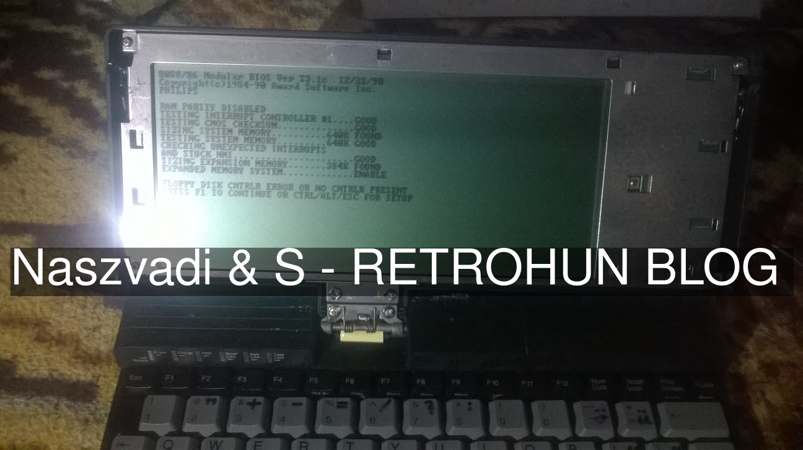
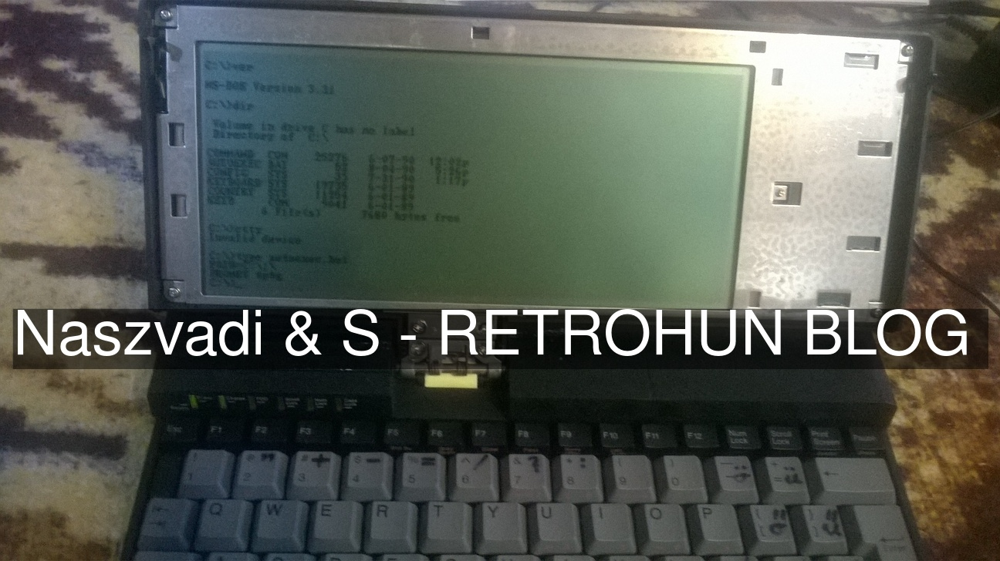

# Philips PCL 101 reanim - Retrohun blog

Some rights reserved! Vintage technology preserved.

[Previous](../coherent30on286) | [Index](../../../../) | [Next](../aixps2part1)
--- | --- | ---

## First steps
A 80C86A based laptop had been purchased in an unknown condition. Suffered from multiple errors, and thanksfully fixed
almost all of them by S. The most difficult part was the rotten and damaged ribbon cable workaround. That cable connects
the display to the mainboard. It was an UGLY HECK(sic!)(tm by Jean-Francois@MAVIR), till the temporary soldering of the cut ribbon wires should be enough. The diskette drive's belt is also damaged, waiting for replacement parts that is ordered already. Basically, after a decent cleanup and the mentioned soldering magic, the machine
boots well, see here:

## ROM DOS version
The ROM DOS version is MSDOS v3.31. COMMAND.COM size is exactly same as of the 3.31 installer's. Check it here:

## To be continued?
Yes. Stay tooned!

[Previous](../coherent30on286) | [Index](../../../../) | [Next](../aixps2part1)
--- | --- | ---
