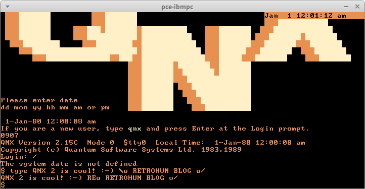

# QNX 2 fun - Retrohun blog

Some rights reserved! Vintage technology preserved.

---

[Previous](../randomupdates1) | [Index](../../../../) | Next
--- | --- | ---

---

## QNX 2
A famous operating system, originally developed for IBM PC & compatibles. All early versions supported real mode (and later 80286-specific protected mode) till version 4.x, where pre-386 support had been dropped since then.

In several guest blog posts made by [Tenox](http://www.tenox.net), there is one with a detailed installation process with several screenshots, like in

- [www.os2museum.com/wp/virtualizing-qnx-2/](http://www.os2museum.com/wp/virtualizing-qnx-2/)
- [virtuallyfun.com/wordpress/2013/03/20/fun-with-virtualizing-qnx-2/](https://virtuallyfun.com/wordpress/2013/03/20/fun-with-virtualizing-qnx-2/)

Got some spare time, so I've made some funny experiments. First, tried to install QNX 2 in [pce-ibmpc](https://github.com/retrohun/pce/), and performed successfully by following these steps:

1. Images from ???????.org, QNX2 Installation hints at the previous links

2. Do not forget to select **_all four_** floppy images when copying files! Their md5 checksums are:

```
03b6522234007cb7c1c7acae64cf6d80  boot.img
716986870a602a3dd5b01c76720fb37f  boot_util.img
638174f05a69f9e7356aecf76d026843  util1.img 
7d5356bc0fde61cc89571b903d824c09  util2.img 
```

3. Selected XT hdd controller and real mode kernel obviously

4. To change (virtual) floppy disk during emulation:

- 4.a: change to monitor by pressing [Ctrl]+["backtick"], then
- 4.b: specify floppy image file via entering "m emu.disk.insert 0:util1.img"
- 4.c: then continue interrupted emulation with command "g"

5. Installed in an 5150 type VM, but unfortunately only 5160 can run it after a seamless installation, with a merged 64k sized rom

6. mda and cga video card types caused unwanted 0xB804 segment far jumps, so hgc is used

7. Be patient when partitioning forces a hdd surface test, needs some time!

8. Of course in step 3: BIOS INT13h disk driver should be selected in order to keep resulting disk image portable

```
 path = "rom"
 path = "-."
 system {
 	model = "5160"
 	boot = 128
 	memtest = 0
 	floppy_disk_drives = 2
 	rtc = 0
 	patch_bios_init = 0
 	patch_bios_int19 = 0
 }
 cpu {
 	model = "8088"
 	speed = 0
 }
 ram {
 	address = 0
 	size = 640K
 	default = 0x00
 }
 rom {
 	address = 0xf0000
 	size = 64K
 	default = 0xff
 }
 rom {
 	address = 0xc8000
 	size = 32K
 	default = 0xff
 }
 load {
 	format = "binary"
 	address = 0xf0000
 	file = "ibmxt64k.rom"
 }
 load {
 	format = "binary"
 	address = 0xc8000
 	file = "ibm-hdc-1985-10-28.rom"
 }
 terminal {
 	driver = "x11"
 	scale = 1
 	aspect_x = 4
 	aspect_y = 3
 	mouse_mul_x = 1
 	mouse_div_x = 1
 	mouse_mul_y = 1
 	mouse_div_y = 1
 }
 video {
 	device = "hgc"
 	color = "amber"
 	blink = 16
 }
 speaker {
 	volume = 500
 	lowpass = 8000
 	sample_rate = 44100
 	driver = "null"
 }
 hdc {
 	address = 0x320
 	irq = 5
 	drive0 = 0x80
 	drive1 = 0x81
 	sectors = 17
 	switches = 0x00
 }
 fdc {
 	address = 0x3f0
 	irq = 6
 	drive0 = 0x00
 	drive0 = 0x01
 	accurate = 0
 	ignore_eot = 0
 }
 disk {
 	drive = 0
 	optional = 1
 	type = "auto"
 	file = "blanka.qed"
 }
 disk {
 	drive = 1
 	optional = 1
 	type = "auto"
 }
 disk {
 	drive = 128
 	type = "auto"
 	file = "10mbqnx2.qed"
 	readonly = 0
 	optional = 1
 }
 disk {
 	drive = 129
 	type = "auto"
 	readonly = 0
 	optional = 1
 }
```

### Virtual QNX 2 is alive!



## 8086tiny and QNX 2 guest
As it is widely (un)known, 8086tiny was the ultimate winner of the International Obfuscated C Code Competition in 2013, Adrian Cable made a ridiculously small but fairly complete IBM PC emulator. Read more here: http://ioccc.org/2013/cable3/hint.html - it can even run Stunts! :D

I believe that even a bare 1024\*16\*63 virtual flat harddisk image can be booted with unmodified bios image containing a QNX 2 guest, but only a minor patch enabled the 8086tiny booting vintage harddisk images with small sizes and 4 heads + 17 SPT, respectively. The patch kept the original c source untouched, just the bios assembly source had been altered. Neozeed announced his testdrives here (thanks!): https://virtuallyfun.com/wordpress/2018/12/03/8086tiny-bios-patch-update/

Oh, and the modifications are available on github: https://github.com/retrohun/8086tiny


## QNX 2 meets DOSBox
Successfully incremented the supported guest operating systems in DOSBox, see more at: https://www.dosbox.com/wiki/Software:QNX2

### More screenshots


## Summary of virtualizaton status

Qemu, Virtualbox, Bochs, VMWare, [pcem](http://pcem-emulator.co.uk) are not listed here, 

| Emulator  | Remarks, modifications                           |
| --------- | ------------------------------------------------ |
| pce-ibmpc | stock build works fine                           |
| 8086tiny  | for vintage hdimages, my bios patch is necessary |
| DOSBox    | stock 0.74 build works with custom cfg           |


## More QNX fun

In the post of Tenox:
[QNX Windows - First Look](https://virtuallyfun.com/wordpress/2013/03/22/the-shape-of-things-to-come/)

---

[Previous](../randomupdates1) | [Index](../../../../) | Next
--- | --- | ---
