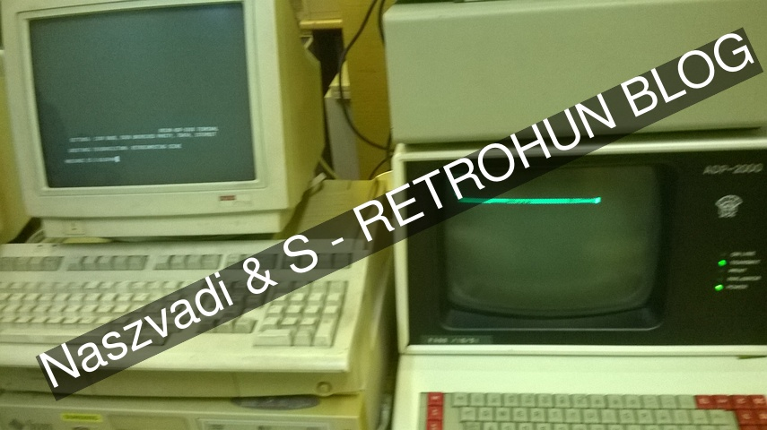
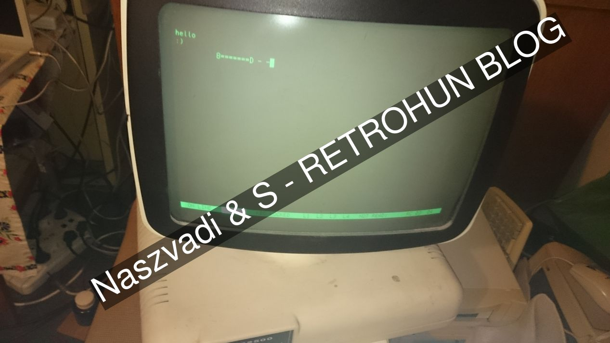
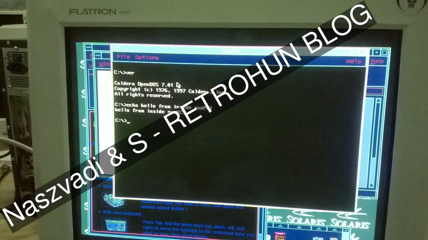
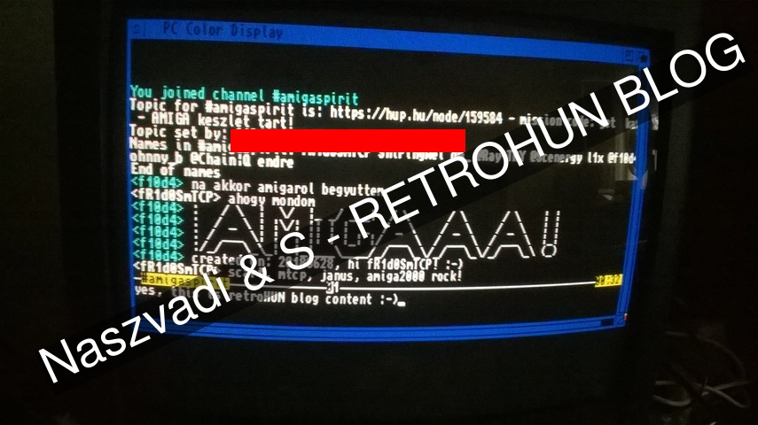
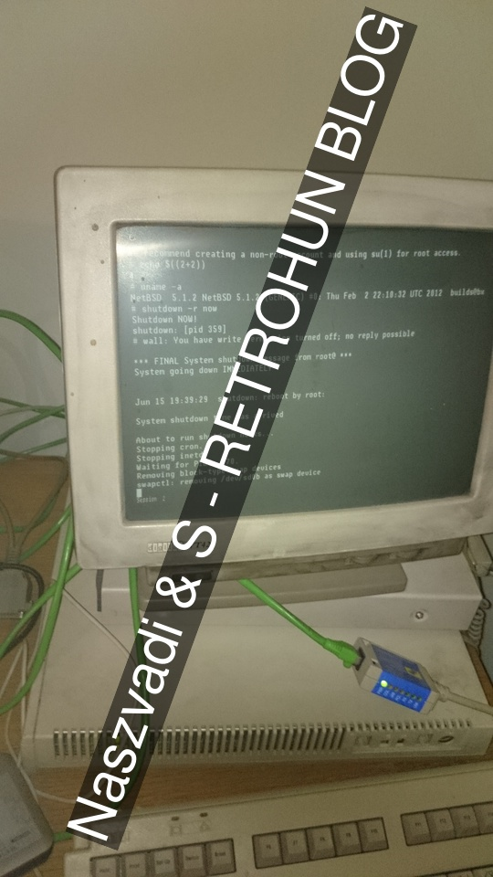
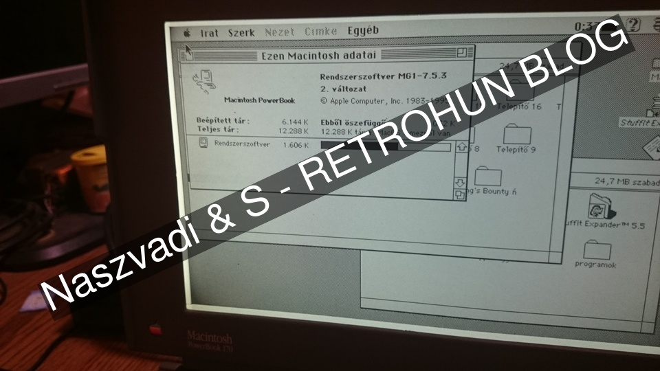
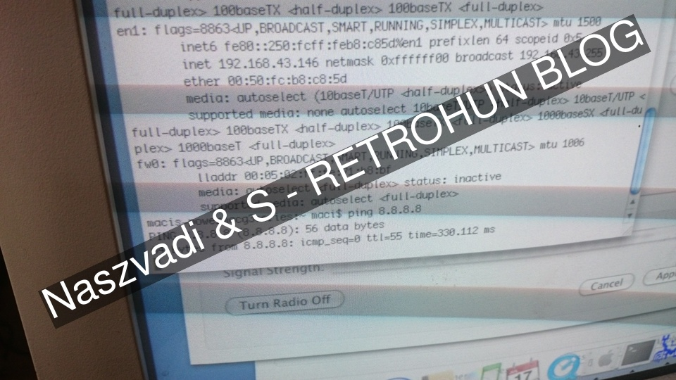
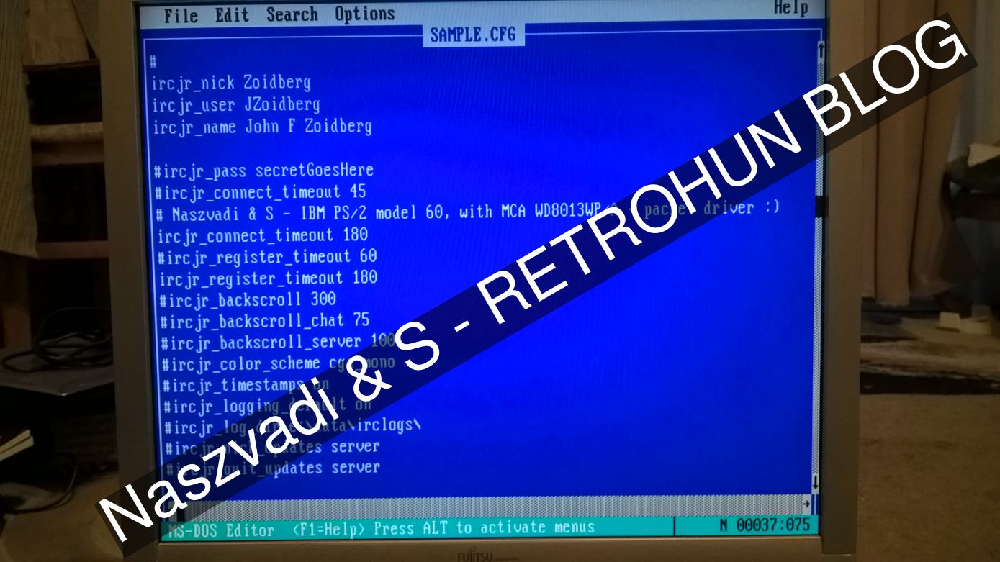
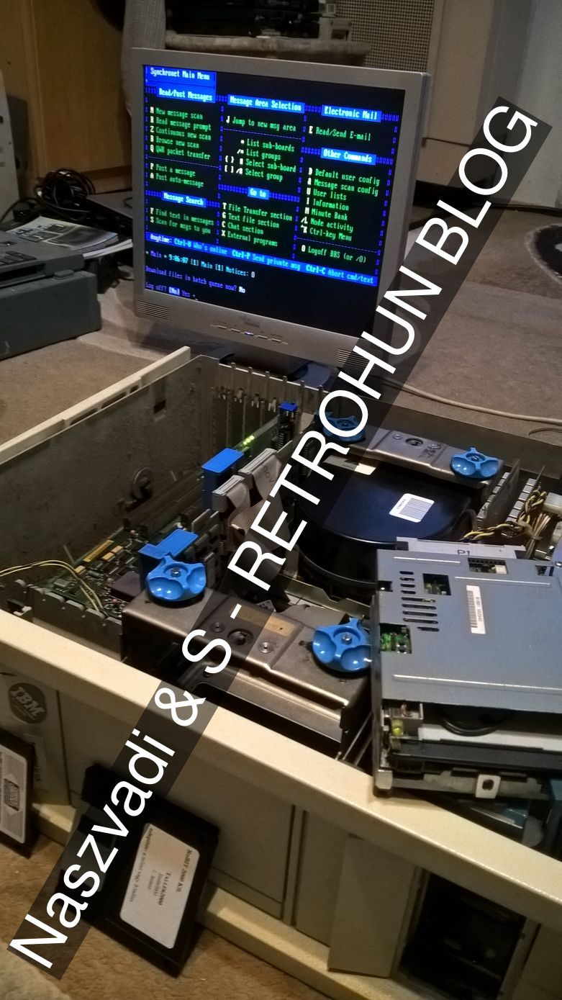

# Random updates 1
Some rights reserved! Vintage technology preserved.

---

[Previous](../orionadp2000info) | [Index](../../../../) | [Next](../qnx2fun)
--- | --- | ---

---

## Selected pictures from machines in our collection - gallery
A bug from 1990 or earlier found by me - reversi easiest mode machine player is plausible - can be beaten easily:

Serial terminals in action - read some about [Orion ADP 200](../orionadp2000info)

This is a vintage Hungarian terminal with common nickname "ET" :-)

PC SbC in UltraSPARC machines and in amiga - Ultra5 - SbC is "Penguin":

Amiga 2000 with an unobtainium DB23-SCART wire connected to an ordinary CRT TV - hence the colours! :-) read more on [Amiga 2000 et al](../amiga2000etal):

A VAXSTATION 4000/30 a.k.a. VLC with external transceiver thus networked:

A GEM (not an os, but a) powerbook 170 - Hungarian OS7 classic installed:

PCI cisco aironet works fine in Tiger on a Powermac G3 BlueWhite:

IBM PS2 model 60 with WDC80x3 MCA network interface card, network configured in msdos:

Telnetting to [Neozeed's BBS](http://bbs.superglobalmegacorp.com/):

The latter machine boots from a **working** ESDI winchester!

## Misc.
The Amiga now extended with an A25000 ram expander. Unfortunately, one of the 1MB banks are faulty, so the wrong one must be disabled with jumpers, otherwise it might hang the Workbench on heavy loads.

---

[Previous](../orionadp2000info) | [Index](../../../../) | [Next](../qnx2fun)
--- | --- | ---
