# Random updates 2
Some rights reserved! Vintage technology preserved.

---

[Previous](../i8080emulatorinbash) | [Index](../../../../) | [Next]
--- | --- | ---

---

## Selected pictures from machines in our collection - gallery

### Mupid C2A2

This z80-based oldtimer beast has incredible graphics capabilites. However this machine usually does not have a boot rom, it has to be booted via a proprietary so-called BTX protocol *remotely* - from another machine using serial port.

### Amiga 2000 - Syquest and ZIP100 drive installation

Our amiga has several goodies like an A2286 pc-emulator bridge card, an upgraded 3.1 Kickstart ROM, and nowadays became totally hdd-less. SCSI units had been replaced to SyQuest 135MB and Zip100 drivers, but for a testdrive-drive a SyQuest 270MB had been installed temporarily and installed without a flaw.

Gotek floppy emulator and amiga 2000 internals exploded view :-)

- 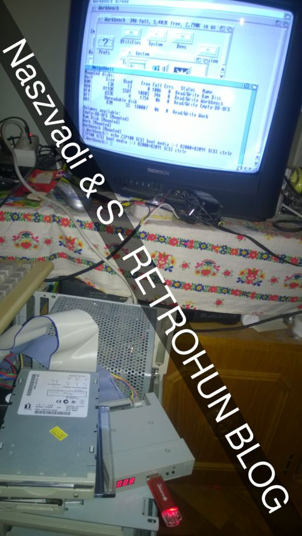

Message in the next-to-last line

- 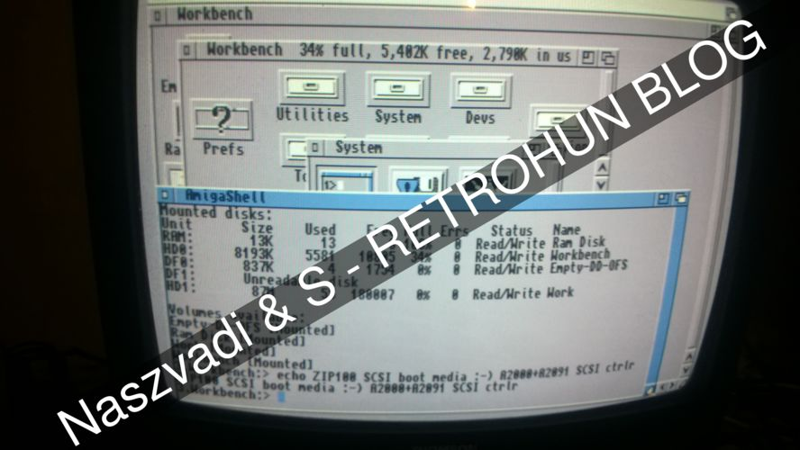

Wire colourings are important to remember!

- 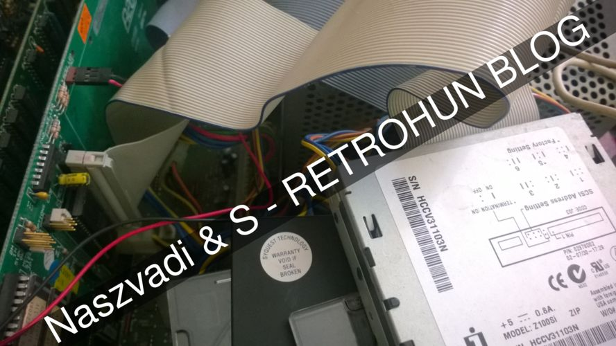

Before assembly - mounting all drives - "I put my screwdriver everywhere!"

- 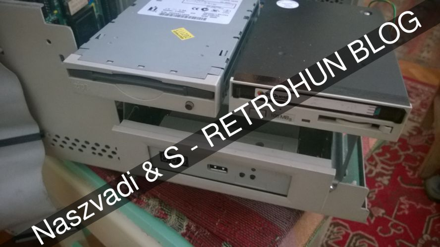

And after - an acer peasea laptop acts as an amiga monitor:

- 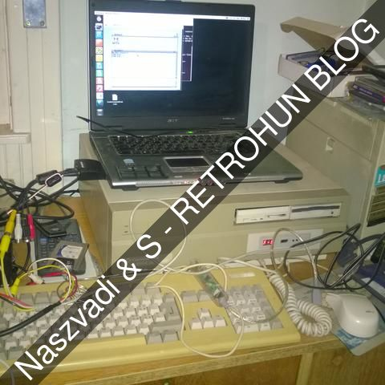

The appropriate linux command line is (without scaling):

 mplayer tv:///1

that starts grabbing video input from the PCMCIA tv tuner card's RCA pigtail. Regardless if it is connected to a signal source or not :-)

The curious can recognise that there is a TI-82+ and its serial cable, an external zip drive for fast data exchange between a pc and the amiga and other goodies for retrocomputing maniacs.

### Got a dozen for Fujitsu Primergy RXi300 Itanium server

Allegedly this machine does not support OpenVMS nor HPUX. Without having a Windows IA64 installer, only an old ubuntu (6.06?) linux image had been written to CD-R and one of the lucky machines had been tested unsuccessfully - it's is a shame that distribution version refuses to install due to the improper kernel modules version delivered on the install media!

Post screen, nice 64 bit config, allegedly without suffering from 3.2G barriers :]

- 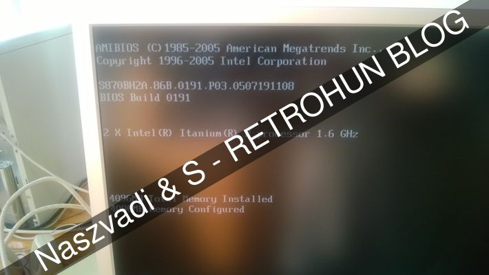

Boot menue

- 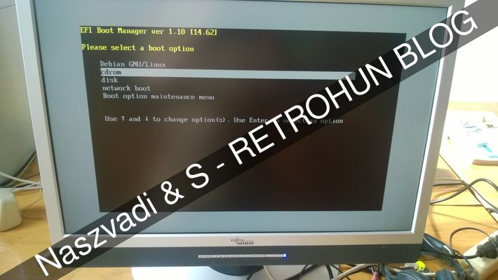

Rack front view

- 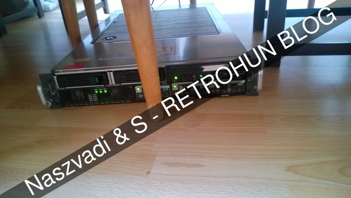

Backside, cabling, somewhat messy without his golden balls :-)

- 

Yes, it has two itanium CPUs!

- 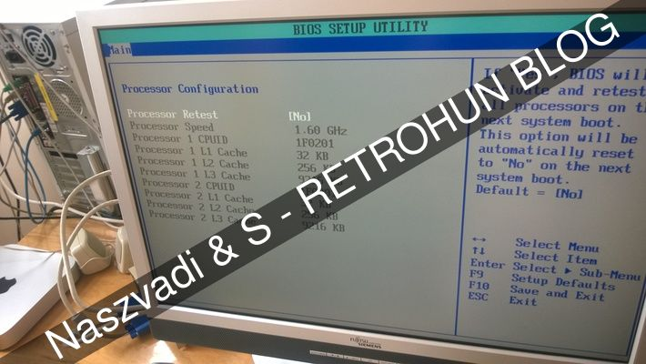

Integrity check on integrity

- 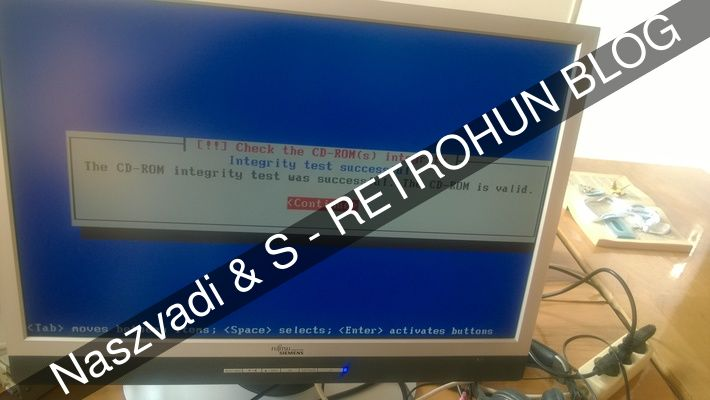

### Testing a 1st gen AppleTV

Purchased and AppleTV and before set up as a gameconsole with gnome games and emulators, tested with OSX 10.4.7 factory OS.

- 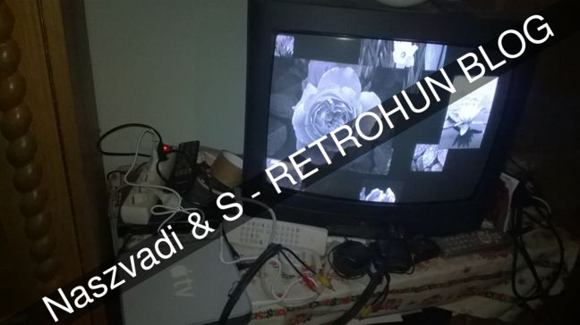

This AppleTV does support composite video signal on green RCA output, using this undocumented feature is supported out-of-the box on osmc linux without any software or hardware tweaks. Needs passive ventillation, it is worth leaving the top case free. It is usually getting hot around the integrated dothan CPU, which dissipates a lot of heat. Later got osmc and debian and now acts as a hobby console/Gnome games box.

### Stock DOSbox vs Netscape 2.x vs gopher

It is known that even stock DOSbox - I mean the version built without network card support - has some networking support that can be configured under guest Windows 3.1

Retro coolness - Browsing floodgap.com gopher site inside DOSBox!

- 

And http - dosboxwiki again from DOSBox!

- 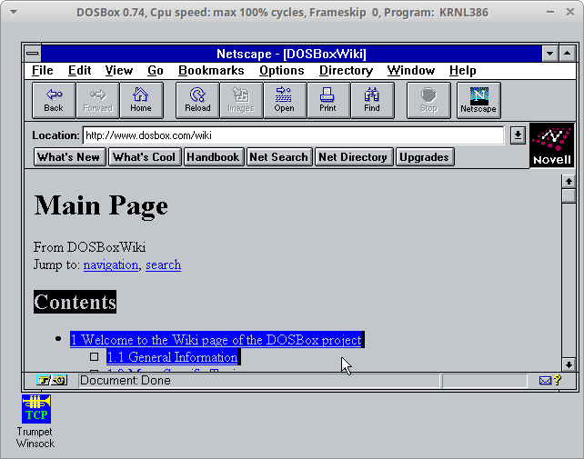

### A dream came true from my childhood

Completed all Jack Attack levels on C64 \o/

- 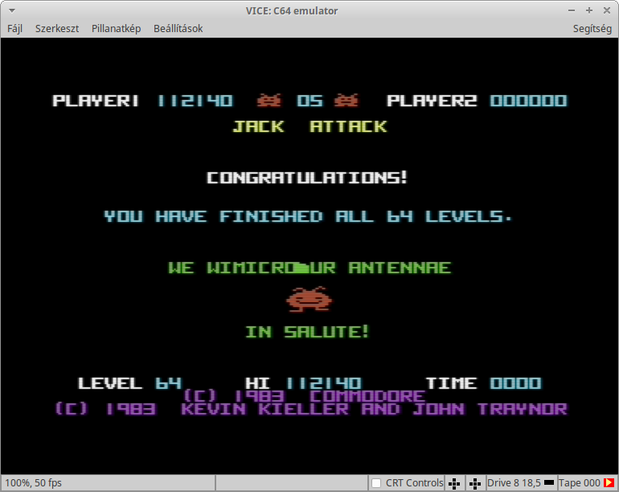

At least! J

## Miscellaneous updates

### Amiga

The amiga had been screwed again and temporarily got a replacement SCSI card instead of the A2091, which had been lent to a friend. Of course Janus A2286 bridgeboard needs to be reinstalled again from scratch due to the last boot media updates.

### Retrobits

Mike Brutman released a new opensourced version of mTCP here:

- https://www.brutman.com/mTCP

My strictly unofficial fork repository now contains patches including serial terminal STDIO support can be cloned from here:

- https://github.com/retrohun/mTCP/tree/master-20200101

---

[Previous](../i8080emulatorinbash) | [Index](../../../../) | [Next]
--- | --- | ---
