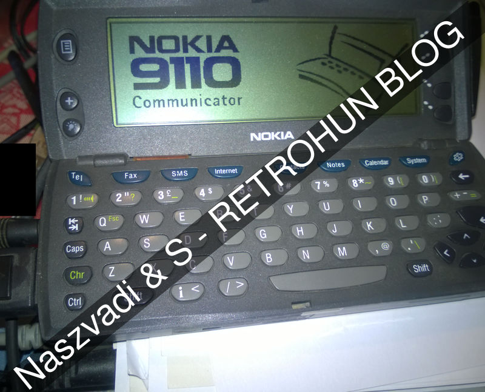
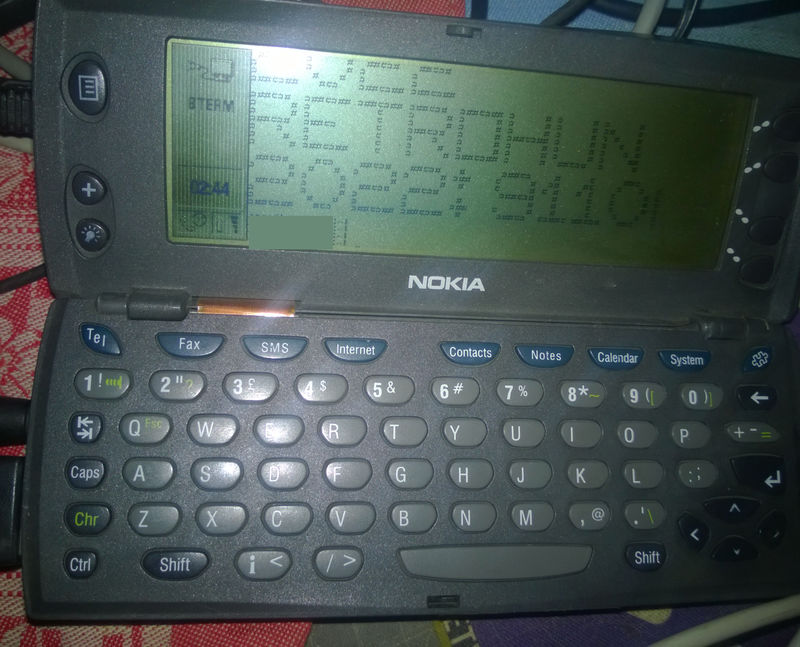
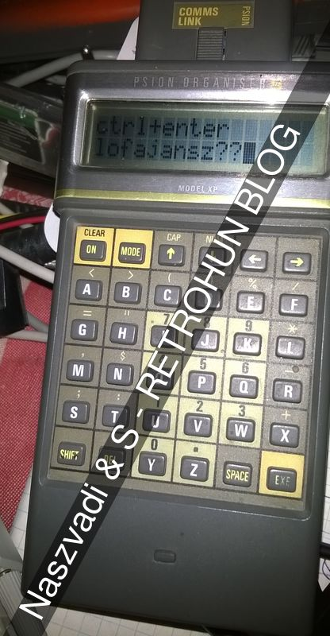
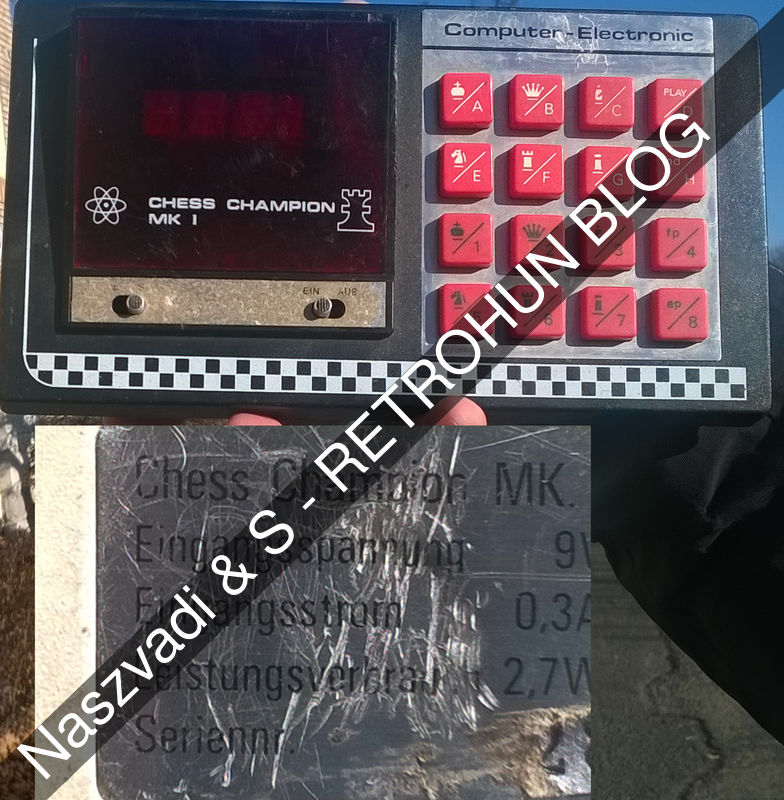
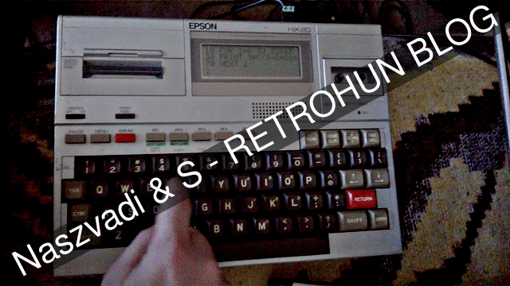

# Random updates 3

Some rights reserved! Vintage technology preserved.

---

[Previous](../zeedoomautoinstaller) | [Index](../../../../) | [Next]
--- | --- | ---

---

## Some handhelds from the past

### Nokia 9110i communicator

There are tons of machines around here we would like to blog about. One of our
favourites is an intel 80486 pc-compatible based computer, the Nokia 9110i
cellphone: a palmtop/early smartphone hybrid!

- 

Notice the qwerty keyboard and a small but still fancy 640x200 mono CGA
resolution that made quite a popular turn-to-a-PC-running-DOS project
candidate among retrocomputing enthusiasts. But we had different goals:
besides patching the builtin ROM-DOS that chainloads GEOS-i386 during bootup
and optionally user-defined command interpreter, like 4DOS' command.com...
Can it be a serial terminal without any complex softmodding?

Traded one some years ago, and then a bad one for spare. Batteries are totally
over, but sadly it is necessary to use them with an external Nokia charger.
Also bought a rare DLR-2L cable, thus it is turned to a cool small serial
terminal in a snap, just needed to transfer some GEOS 9xxx compatible serial
terminal program from a hp elitebook connected to its docking station with
serial port, which had been passed to a VirtualBox guest. Then the host unix
spawned a tty on the serial port, the result is:

- 

MD5 checksums of necessary communicator-specific data transfer softare called
"PC Suite for Nokia 9110 Communicator Version 1.3 (15-Feb-00)"

```
9c03bdabf3159a3e60fb5e4e7d10392a DISK1/DISK1.ID
f94ad021fe1d4ac42af915e7641fc6aa DISK1/README.TXT
d5b13f1c03a5b0b5758e6f6b68a790ae DISK1/SETUP.INS
3aafeafb35aa81bb1bec362830244684 DISK1/SETUP.EXE
d1b32f54a23077260697c754a7715a44 DISK1/SETUP.INI
d6124b98941d1f4913933ce8c4a2c6f9 DISK1/SETUP.PKG
fcd6a0b71e78380e8672b50520409828 DISK1/SYSTEM.1
737f5769046feab6f54337efadb84174 DISK1/_INST32I.EX_
8b869cff1182eb88649817a04454801b DISK1/_SETUP.DLL
c3200e3277aef0e5d150d797aa62d55f DISK1/_ISDEL.EXE
c8d4c7224120bea606d1b7d0e5d89fab DISK1/_SETUP.LIB
f30b7c5089fceb01c3d777f3c3f793f1 DISK2/DISK2.ID
3e49c8d1aedebd82dade84d87cd47b25 DISK2/PROGRAM.1
bc8486eee00c0c7d059adc90257cd0b7 DISK2/SYSTEM.2
f30b7c5089fceb01c3d777f3c3f793f1 DISK3/DISK3.ID
30473ebc8ce21bff470462a85a190f6f DISK3/PROGRAM.2
f30b7c5089fceb01c3d777f3c3f793f1 DISK4/DISK4.ID
3a0161ada7e983c752772b9ab910781d DISK4/ASCII.Z
08c77f76bd72765cac56309242306fcc DISK4/LNOTES.1
70305c0fb53bd1538801d74e4e34cd58 DISK4/ORG97GS.Z
eb6317b9c0ff662987504915ef9830f2 DISK4/PROGRAM.3
f30b7c5089fceb01c3d777f3c3f793f1 DISK5/DISK5.ID
6e8fbc64c03525586e74cbc6deb53948 DISK5/LNOTES.2
0c798456572d8a4513ea485b97f481d7 DISK5/OUTLOOK.Z
67f6dc850eb06ef5f2aadcefd33c05b2 DISK5/SCHDPLUS.Z
```

### Psion handheld series

We have some PsionII devices, LZ64, and many XPs, and dozens of 3rdparty
accessories, dataPAKs, pigtails etc. Despite they have ABC-keyboard layout,
it is fun using them with a newly acquired serial port adapter from the
local HAM-fleamarket. It was fun... for a short period (2-3 minutes before
giving up typing like a woodpecker)

- 

Well, have to admit that these machines are still awesome! Low consumption,
cool desing, and using DOSBox + psion2 for msdos emulator as an SDK, quite
hackable. Delivered with a compiled(?) programming language, namely OPL:
converting my mastermind.bas and other games with basic sources weren't too
difficult due to OPL's basic-alike syntax. On a daily basis I use one of them
as a mastermind gamer machine, highly addictive!

### Chess Champion MK-I

This pile of junk got for beans also from a local retrocomp market, added
to restoration project queue. Hoping it will popped out in this millenium!

- 

Notes, allowed PSU limits:

| Setting      | Value |
| ------------ | -----:|
| **U**        | 9V    |
| **I**        | 0.3A  |
| **P**        | 2.7W  |
| **Polarity** | ?     |

### Epson HX-20

Accidentaly purchased the world's first real notebook: the Epson HX-20.
This weird had been delivered with its original plastic luggage case.
One of its strange properties is that this computer contains two identical
CPUs! (Hello 1980!) This machine has builtin cassette unit and a small ribbon
printer. Despite it could use an external PSU, still needs (a dead, but not
(yet) leaking) battery. According to the manuals, it has an internal jumper
switch that could enable to connect external colour display. The builtin LCD
is a dot matrix screen, resolution is 4 lines, 20 character columns wide
(4 megabytes of animated .gif):

- 

The following 3-liner basic code had been entered, which is basic-ally a
primitive sinewave-scroller - a reminder: next time wider string should
have been printed...

```
10 FOR I=1 TO 8888
20 PRINT SPC(9+9*SIN(I/3));"X"
30 NEXT I
```

### Bonus: VDX-52600 serial terminal

A friend of us, Mátyás has some really cool vintage stuff, one of them
is still in productive environment. I had the opportunity to test it
with bsd tetris, see the following animated gif: (cca. 8 megabytes!)

- 

This VT100-compatible terminal was manufactured in Hungary behind the
iron curtain, containing a Z80A CPU. It is a Videoton VDX-52600, it has the
nickname "E.T." due to certain similarities :)

## Related links

- [Communicator specific pc_suite13.zip](?????.???-??.ru/geos/nokia9110/pc_suite13.zip)
- [Jaapsch rocking PsionII stuff](https://www.jaapsch.net/psion/)
- [Chess Champion MK1](https://www.chessprogramming.org/Chess_Champion_MK_I)
- [Epson HX-20 Wikipedia article](https://en.wikipedia.org/wiki/Epson_HX-20)
- [VDX-52600 "E.T." in the collection of Nagy Károly](https://retropages.hu/theme_46.html)
- [VDX-52600 with 3rd party(!) keyboard](http://www.leningrad.su/museum/show_calc.php?n=405)
- [Koniorczyk Matyas - The 8-bit inspiration](https://www.kfki.hu/~koniorczykmatyas/8bitinspiration/)

## Have fun!

[Previous](../zeedoomautoinstaller) | [Index](../../../../) | [Next]
--- | --- | ---
