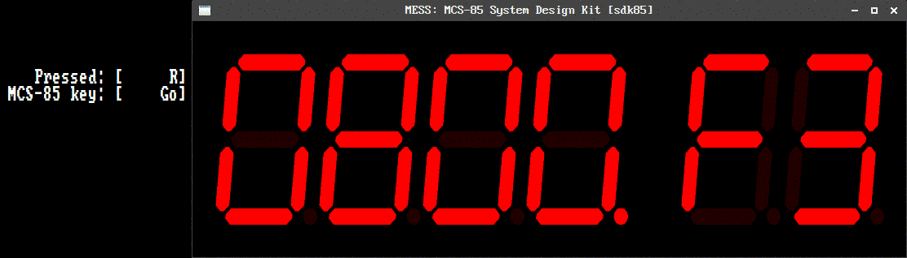

# SDK-85 fun - part 4

Some rights reserved! Vintage technology preserved.

---

[Previous](../sdk85funpart3) | [Index](../../../../) | [Next]
--- | --- | ---

---

# MCS-85 secondary rom bank 101 

An example session - continued from [SDK-85 fun - part 1](dt/sdk85funpart1)

### Howto boot custom rom bank from Intel MCS-85 monitor

If MAME/MESS64 is used, press space twice to get over intro
screen! Other steps are same in both virtual or baremetal
environments.

Below is the sdk85's greetings, "POST screen" meaning evboard is okay
and ready to use.

###

The stack pointer and program counter MUST have been initialized before
work! Let's assign values 20C2H and 0800H to SP and PC respectively:

Examine registers:

- 

Jump through F register:

- 

Jump through again:

- 

And again:

- 

Still not stack pointer:

- 

At least!

- 
- 
- 
- 
- 
- 

Now PC register is set:

- 
- 
- 
- 
- 
- 

Pressing "Next" finishes examining CPU registers, then "Go" and
"Exec" should have been pressed in order to boot secondary rom
bank:

- 
- 
- 

Till this, every steps are the same regardless of the contents
of the custom rom bank, entry points - PC values may vary.

### Having fun with custom mastermind ROM

"0" to press in order to start a new game

- 

First 3 guesses are cut, just 2 finals were kept before winning
the game. Next-to-last try is "5 6 2 1"

- 
- 
- 
- 

"Two bulls one cow" :-) Two black sticks and one white:

- 

"6 4 2 1" succeeded!

- 
- 
- 
- 

Machine celebrates winner blinking seven segment LED display:

- 

Button "3" must be pressed in order to continue and show number
of tries:

- 

Pressing zero restarts the game:

- 

Have fun!

### Keyboard layout incompatibility notes with new MAME

MAME developers silently(?) changed the keyboard mapping in sdk85.
For the curious a rosetta table is below, the latest valid
mappings are in sdk85.cpp in MAME's source repository.

| MCS-85 | Old mapping | New mapping |
| ------ | ----------- | ----------- |
|   0    |      0      |      0      |
|   1    |      1      |      1      |
|   2    |      2      |      2      |
| 3  I   |      3      |      3      |
| 4 SPH  |      4      |      4      |
| 5 SPL  |      5      |      5      |
| 6 PCH  |      6      |      6      |
| 7 PCL  |      7      |      7      |
| 8  H   |      8      |      8      |
| 9  L   |      9      |      9      |
|   A    |      A      |      A      |
|   B    |      B      |      B      |
|   C    |      C      |      C      |
|   D    |      D      |      D      |
|   E    |      E      |      E      |
|   F    |      F      |      F      |
|  Exec  |      Q      |      .      |
|   Go   |      R      |      G      |
|  Next  |      Up     |      ,      |
|  Exam  |      Y      |      X      |
|  Subst |      T      |      S      |
| Single |      U      |      /      |

### Remarks

Apologies about the screenshots: it was a bit new to us (or
just forgotten decades ago) that 4-5-6-7 buttons are shortcuts
for SP and PC when examining registers!

According to our knowledge, there is no official working
MCS-85 secondary rom bank support in MAME, hopefully it will
change in the near future!

Have fun!

## Links

- [Wiki docs](https://en.wikipedia.org/wiki/Intel_System_Development_Kit#SDK-85)
- [MAME source repository](https://github.com/mamedev/mame)

---

[Previous](../sdk85funpart3) | [Index](../../../../) | [Next]
--- | --- | ---
