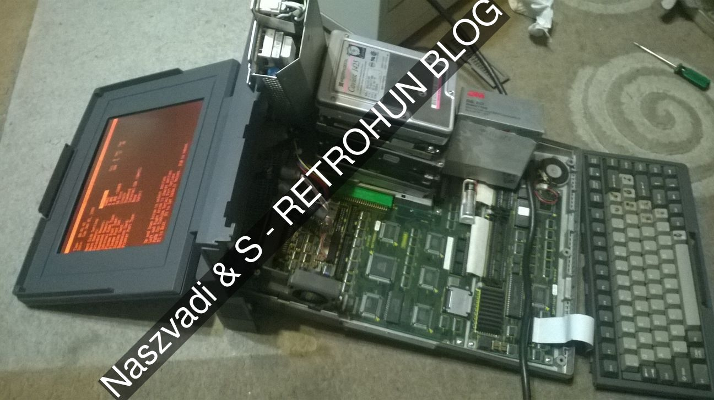
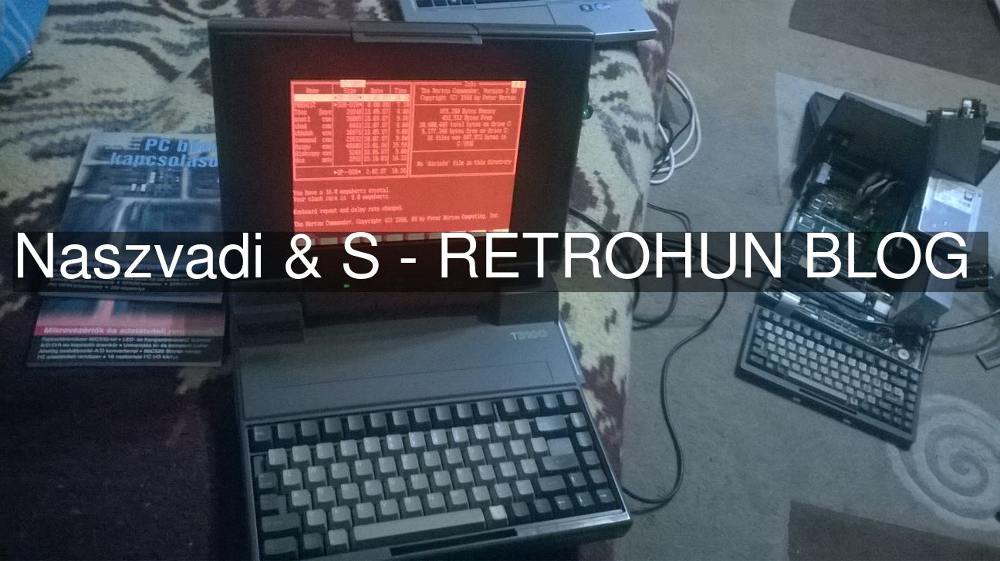

# Toshiba T3100 fun - Retrohun blog

Some rights reserved! Vintage technology preserved.

---

[Previous](../aixps2part1) | [Index](../../../../) | [Next](../xenix286ondemand)
--- | --- | ---

---

## In medias res
Purchased some dozens of retrocomputers again (as usual :P). Some of them had been being tested.
A beautiful one is the Toshiba T3100, which is to be shown together with her sister. This machine
is almost the same as the T3100E we already have, but manufactured without a factory harddisk.
Now here come the photos of the disassembled T3100 and then in comparison with the fully-functioning
T3100E:

Comparison of the two machines (they are on). Notice the nice background stuff and ignore the mess:

Cleanup, cmos battery check, reinstall, ISA bus test is on the list.

## Other sources about these hardware
On [Wikipedia](https://en.wikipedia.org/wiki/Toshiba_T3100), for example.

---

[Previous](../aixps2part1) | [Index](../../../../) | [Next](../xenix286ondemand)
--- | --- | ---
