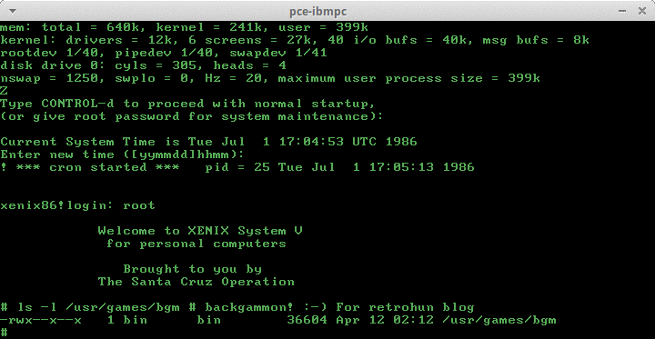
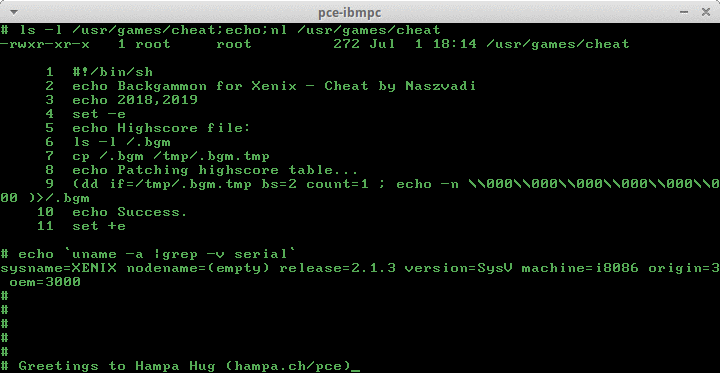
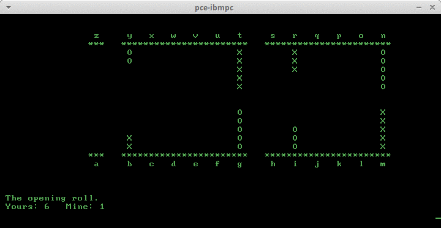

# Xenix tales

Some rights reserved! Vintage technology preserved.

---

[Previous](../bootingfromcassette) | [Index](../../../../) | [Next](../mischardwareprojects)
--- | --- | ---

---

## Xenix 8086 fun
This post is about vintage gaming in vintage unusual operating systems, focused on Xenix/x86.
Tried Hampa's [turnkey xenix86 images](http://hampa.ch/pce/download.html)
while they had been tested in fake86, 8086tiny and other emulators. The installation was
surprisingly easy, because most software packages in floppy/tape images are basically
in .tar format, so let's check GAMES 360k floppy image's content on host:

```
$ (LC_ALL=C ls -l GAMES;tar tvf GAMES)|sed -r 's/ {8}//;1s/([^ ]* ){4}//;s/^/ /'
368640 Apr 20  1999 GAMES
-r--r--r-- 0/0       0 1986-05-22 21:58 ./tmp/_lbl/prd=xnxsv/typ=n86/rel=2.1.3/vol=01
-rw-r--r-- 3/3    1559 1986-05-28 19:32 ./tmp/perms/games
-rwx--x--x 3/3   36604 1986-04-12 04:12 ./usr/games/bgm
-rw-r--r-- 3/3    3474 1986-04-12 04:12 ./usr/games/doc/bgm
-rwx--x--x 3/3   30118 1986-01-05 06:46 ./usr/games/chase
-rw-rw-rw- 3/3       0 1986-01-10 23:37 ./usr/games/lib/chase.scores
-rwx--x--x 3/3   18789 1985-09-14 02:28 ./usr/games/greed
-rw-rw-rw- 3/3       0 1985-09-14 02:28 ./usr/games/lib/greed.ten
-rwx--x--x 3/3   29560 1985-11-22 08:52 ./usr/games/mind
-rwx--x--x 3/3   29447 1986-03-12 23:46 ./usr/games/reversi
-rwx--x--x 3/3  106732 1985-10-04 21:42 ./usr/games/rogue
-rw-rw-rw- 3/3       0 1986-03-09 20:43 ./usr/games/lib/rogue_roll
-rwx--x--x 3/3   13448 1985-10-03 09:43 ./usr/games/worms
-rwx--x--x 3/3   15208 1986-04-12 04:16 ./usr/games/wimp
-rw-r--r-- 3/3    2906 1985-09-14 02:28 ./usr/games/doc/greed
-rw-r--r-- 3/3   28286 1985-10-04 21:42 ./usr/games/doc/rogue
-rw-r--r-- 3/3    2460 1986-04-12 04:16 ./usr/games/doc/wimp
$
```

Also it is widely known that on a Xenix system (86, 80286, 80386 etc.) there is a
hardlink "/dev/install" created during the installation that points to the installation
source drive. So just simply type (without leading hash prompt :)

    # tar tvf /dev/install|more

in order to get a list of files being installed (optional), and then

    # tar xvf /dev/install|more

to extract all of them. My favourite games from the above list are bgm (backgammon), chase (robots), mind (mastermind) and reversi. This is also interesting for the fans at least that there is a rogue build!

### Some screenshots







Shell scripting is a hell in xenix86 as well as in other commercial ?nix variants still the beginnings. The script just truncates the ".bgm" high score table file keeping its first word, which denotes the user's score, and then pads zerobytes till length 8, resetting machine's score. Without /dev/zero or printf with or without awk, it was a little bit challenging, but solved immediately when discovered that echo command handles octal ASCII escape codes without the "-e" switch. Yuck! Fortunately there were the usual handy hexdump/octaldump utilites: hd and od.

## Xenix 386 does support QEMU's ne2k_isa interface!
Yes, not joking! Some friend pinpointed that dlink had made several clone network interface cards for 3COM's etherlink, for AMD pcnet etc. and fortunately for NE1000/NE2000; this NIC was the forgotten DE200 - do not get confused, this is not similar to DE220! After many decades, the drivers are available even for unusual vintage systems like AT@T SysV/i386, but the most interesting part was finding the SCOXENIX/ folder in the driver archive bundle. So extracted them in an environment that supports case sensitive filesystem and tar. Of course the nonbinary(!) files in the SCOXENIX directory - the text files - needed to be converted to unix format from MSDOS format, which meant that line endings contained unnecessary 0x0d bytes, so in-place conversion oneliner

    perl -i -pe s/\\r//g [text file list]

did the rest. Then saved the readme/howto textfile onto the hosts and it remained open in a text reader during the QEMU installation process.

### Prerequisities for installing NE2000 compatible driver
Needs an installed Xenix/386 2.3.4 with latest(?) STREAMS and TCP/IP packages (1 and 3 DSHD floppy images, respectively). Then follow the steps in README.DOC. The curious reader can refer as "/dev/install" to the installation drive just like in xenix8086. I've made a floppy image (.tar file extended with zeroes till 1440kbytes size), download link at the end of this post.

### Known issues
Routing problems from the guest: cannot connect other machines that host, but for irc clients, a socat ssl tunnel from host solved this "problem", so even freenode can be used with ircii - AT YOUR OWN RISK! :-P :-D

    $ socat TCP4-LISTEN:6667 TCP4:YOUR.FAVOURITE.IRCSERVERS.DOMAIN:6667

The is the launching script for a 825,16,63 chs-sized (~400MB) hdimage:

```
#!/bin/bash
qemu-system-i386             \
    -M isapc                 \
    -m 16                    \
    -cpu 486                 \
    -no-reboot               \
    -net nic,model=ne2k_isa  \
    -net user,restrict=off,hostfwd=tcp:127.0.0.1:25523-:23 \
    -fda de200.img           \
    -hda 825x16x63.vmdk      \
    -no-fd-bootchk
```

After booting the Xenix, which definiately needs interaction in order to start TCP/IP services such as telnetd, one can use telnet from the host:

<pre -- host console log, telnet client invocation>
user@errorlevel:0:~/Work/20190102/xenix386$ telnet 127.0.0.1 25523
Trying 127.0.0.1...
Connected to 127.0.0.1.
Escape character is '^]'.


System V.2.3.4 UNIX (xnxhost.xnxhost.com) (ttyp00)

login: root
Password:

                     Welcome to SCO XENIX System V

                                 from

                     The Santa Cruz Operation, Inc.

TERM = (ansi)
# echo 'Hello there!'
Hello there!
# cd /usr/games
# pwd
/usr/games
# echo '** installed games ** ': *
** installed games ** : README Ularn adv aliens bgm bs chase chess cursive cutup doc dots fish gin go greed hangman hotel jewel lib life maze mille mind number ocelot ogre paranoia pig poker quiz rain reversi rot spew stars tetris trek tttt urogue wanderer worms wump yacht yow
#
</pre>

### TO-DO, ideas
Installing X11R5, Autocad for Unix, Openstack image etc. ENOTIME

### Driver stuff for Xenix386

- [de200.img.gz](de200.img.gz) - gunzip it before use!

---

[Previous](../bootingfromcassette) | [Index](../../../../) | [Next](../mischardwareprojects)
--- | --- | ---
