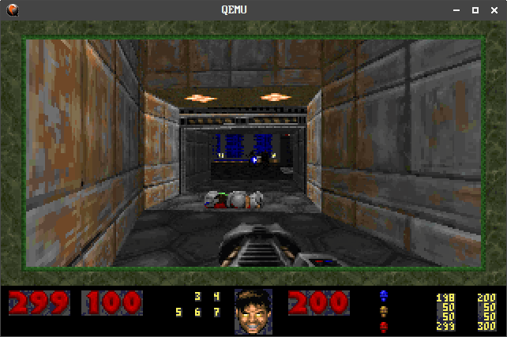
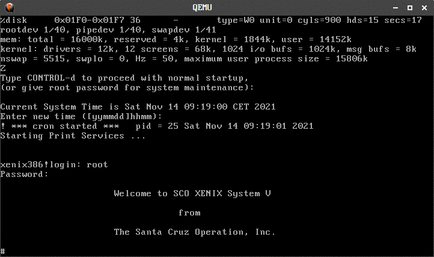
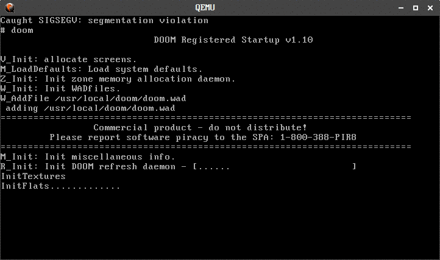
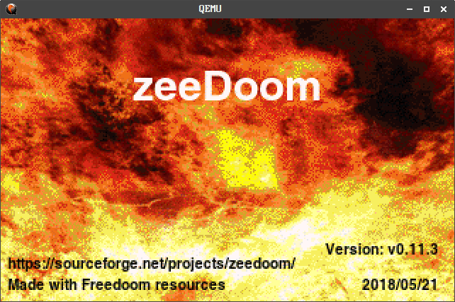

# zeeDoom autoinstaller

Some rights reserved! Vintage technology preserved.

---

[Previous](../i8080emulatorupdate) | [Index](../../../../) | [Next](../randomupdates3)
--- | --- | ---

---

## What is zeeDoom?

Neozeed et al managed to access graphic video modes under xenix, and quickly built an appropriate
doom port...



## Xenix386 on demand

...so I altered and extended the Xenix286 from-scratch-VM autoinstaller script, which
contains the following stuff at the moment:

- Xenix386 v2.3.4 (for 80386 or newer cpu)
- Games package
- Tetris for 286
- (fake) Mouse setup triggered during install (doom build's requirement)
- Doom binary package (total 5 floppies)
- md5 checksums of all floppy images provided
- hard disk with C/H/S geometry 900/15/17

The resulting Xenix386 hard disk image is a real retrogamer heaven incl. tetris,
backgammon, robots, and last but not least: doom! :)

Default credentials are root/xenix386 for username/password. "/usr/games" folder is in the
PATH variable, so simply type doom command after login in order to launch your favourite
one-player gauntlet!

### Example session

```
Script started on Sat Nov 13 10:11:41 2021
user@errorlevel:0:~/github.com/retrohun/blog/dt/zeedoomautoinstaller$ time ./deployxenix386qemu.sh
Xenix 386 v2.3.4 will be deployed
Author: Naszvadi, Peter, 2018, 2021
ga.tar: OK
b1.tar: OK
doom1.tar: OK
doom2.tar: OK
doom3.tar: OK
doom4.tar: OK
doom5.tar: OK
n1.img: OK
n2.tar: OK
tetri286.tar: OK
x1.tar: OK
x2.tar: OK
x3.tar: OK
x4.tar: OK
229500+0 records in
229500+0 records out
117504000 bytes (118 MB, 112 MiB) copied, 0.511683 s, 230 MB/s
WARNING: Image format was not specified for 'n1.img' and probing guessed raw.
         Automatically detecting the format is dangerous for raw images, write operations on block 0 will be restricted.
         Specify the 'raw' format explicitly to remove the restrictions.
WARNING: Image format was not specified for 'b1.tar' and probing guessed raw.
         Automatically detecting the format is dangerous for raw images, write operations on block 0 will be restricted.
         Specify the 'raw' format explicitly to remove the restrictions.
QEMU 2.5.0 monitor - type 'help' for more information
WARNING: Image format was not specified for 'x1.tar' and probing guessed raw.
         Automatically detecting the format is dangerous for raw images, write operations on block 0 will be restricted.
         Specify the 'raw' format explicitly to remove the restrictions.
QEMU 2.5.0 monitor - type 'help' for more information
ide0-hd0 (#block146): ./xenix386_c900h15s17_113m.img (raw)
    Cache mode:       writeback

floppy0 (#block512): x1.tar (raw)
    Removable device: not locked, tray closed
    Cache mode:       writeback
QEMU 2.5.0 monitor - type 'help' for more information
WARNING: Image format was not specified for 'x2.tar' and probing guessed raw.
         Automatically detecting the format is dangerous for raw images, write operations on block 0 will be restricted.
         Specify the 'raw' format explicitly to remove the restrictions.
QEMU 2.5.0 monitor - type 'help' for more information
ide0-hd0 (#block146): ./xenix386_c900h15s17_113m.img (raw)
    Cache mode:       writeback

floppy0 (#block733): x2.tar (raw)
    Removable device: not locked, tray closed
    Cache mode:       writeback
QEMU 2.5.0 monitor - type 'help' for more information
WARNING: Image format was not specified for 'x3.tar' and probing guessed raw.
         Automatically detecting the format is dangerous for raw images, write operations on block 0 will be restricted.
         Specify the 'raw' format explicitly to remove the restrictions.
QEMU 2.5.0 monitor - type 'help' for more information
ide0-hd0 (#block146): ./xenix386_c900h15s17_113m.img (raw)
    Cache mode:       writeback

floppy0 (#block969): x3.tar (raw)
    Removable device: not locked, tray closed
    Cache mode:       writeback
QEMU 2.5.0 monitor - type 'help' for more information
WARNING: Image format was not specified for 'x4.tar' and probing guessed raw.
         Automatically detecting the format is dangerous for raw images, write operations on block 0 will be restricted.
         Specify the 'raw' format explicitly to remove the restrictions.
QEMU 2.5.0 monitor - type 'help' for more information
ide0-hd0 (#block146): ./xenix386_c900h15s17_113m.img (raw)
    Cache mode:       writeback

floppy0 (#block1108): x4.tar (raw)
    Removable device: not locked, tray closed
    Cache mode:       writeback
QEMU 2.5.0 monitor - type 'help' for more information
WARNING: Image format was not specified for 'n1.img' and probing guessed raw.
         Automatically detecting the format is dangerous for raw images, write operations on block 0 will be restricted.
         Specify the 'raw' format explicitly to remove the restrictions.
QEMU 2.5.0 monitor - type 'help' for more information
ide0-hd0 (#block146): ./xenix386_c900h15s17_113m.img (raw)
    Cache mode:       writeback

floppy0 (#block1347): n1.img (raw)
    Removable device: not locked, tray closed
    Cache mode:       writeback
QEMU 2.5.0 monitor - type 'help' for more information
WARNING: Image format was not specified for 'n2.tar' and probing guessed raw.
         Automatically detecting the format is dangerous for raw images, write operations on block 0 will be restricted.
         Specify the 'raw' format explicitly to remove the restrictions.
QEMU 2.5.0 monitor - type 'help' for more information
ide0-hd0 (#block146): ./xenix386_c900h15s17_113m.img (raw)
    Cache mode:       writeback

floppy0 (#block1510): n2.tar (raw)
    Removable device: not locked, tray closed
    Cache mode:       writeback
QEMU 2.5.0 monitor - type 'help' for more information
WARNING: Image format was not specified for 'ga.tar' and probing guessed raw.
         Automatically detecting the format is dangerous for raw images, write operations on block 0 will be restricted.
         Specify the 'raw' format explicitly to remove the restrictions.
QEMU 2.5.0 monitor - type 'help' for more information
ide0-hd0 (#block146): ./xenix386_c900h15s17_113m.img (raw)
    Cache mode:       writeback

floppy0 (#block1729): ga.tar (raw)
    Removable device: not locked, tray closed
    Cache mode:       writeback
QEMU 2.5.0 monitor - type 'help' for more information
WARNING: Image format was not specified for 'tetri286.tar' and probing guessed raw.
         Automatically detecting the format is dangerous for raw images, write operations on block 0 will be restricted.
         Specify the 'raw' format explicitly to remove the restrictions.
QEMU 2.5.0 monitor - type 'help' for more information
ide0-hd0 (#block146): ./xenix386_c900h15s17_113m.img (raw)
    Cache mode:       writeback

floppy0 (#block1926): tetri286.tar (raw)
    Removable device: not locked, tray closed
    Cache mode:       writeback
20.19.18.17.16.15.14.13.12.11.10.9.8.7.6.5.4.3.2.1.
WARNING: Image format was not specified for 'doom1.tar' and probing guessed raw.
         Automatically detecting the format is dangerous for raw images, write operations on block 0 will be restricted.
         Specify the 'raw' format explicitly to remove the restrictions.
QEMU 2.5.0 monitor - type 'help' for more information
WARNING: Image format was not specified for 'doom2.tar' and probing guessed raw.
         Automatically detecting the format is dangerous for raw images, write operations on block 0 will be restricted.
         Specify the 'raw' format explicitly to remove the restrictions.
QEMU 2.5.0 monitor - type 'help' for more information
ide0-hd0 (#block142): ./xenix386_c900h15s17_113m.img (raw)
    Cache mode:       writeback

floppy0 (#block516): doom2.tar (raw)
    Removable device: not locked, tray closed
    Cache mode:       writeback
QEMU 2.5.0 monitor - type 'help' for more information
WARNING: Image format was not specified for 'doom3.tar' and probing guessed raw.
         Automatically detecting the format is dangerous for raw images, write operations on block 0 will be restricted.
         Specify the 'raw' format explicitly to remove the restrictions.
QEMU 2.5.0 monitor - type 'help' for more information
ide0-hd0 (#block142): ./xenix386_c900h15s17_113m.img (raw)
    Cache mode:       writeback

floppy0 (#block704): doom3.tar (raw)
    Removable device: not locked, tray closed
    Cache mode:       writeback
QEMU 2.5.0 monitor - type 'help' for more information
WARNING: Image format was not specified for 'doom4.tar' and probing guessed raw.
         Automatically detecting the format is dangerous for raw images, write operations on block 0 will be restricted.
         Specify the 'raw' format explicitly to remove the restrictions.
QEMU 2.5.0 monitor - type 'help' for more information
ide0-hd0 (#block142): ./xenix386_c900h15s17_113m.img (raw)
    Cache mode:       writeback

floppy0 (#block903): doom4.tar (raw)
    Removable device: not locked, tray closed
    Cache mode:       writeback
QEMU 2.5.0 monitor - type 'help' for more information
WARNING: Image format was not specified for 'doom5.tar' and probing guessed raw.
         Automatically detecting the format is dangerous for raw images, write operations on block 0 will be restricted.
         Specify the 'raw' format explicitly to remove the restrictions.
QEMU 2.5.0 monitor - type 'help' for more information
ide0-hd0 (#block142): ./xenix386_c900h15s17_113m.img (raw)
    Cache mode:       writeback

floppy0 (#block1193): doom5.tar (raw)
    Removable device: not locked, tray closed
    Cache mode:       writeback
Exiting.

real    5m51.421s
user    0m50.099s
sys     0m16.176s
user@errorlevel:0:~/github.com/retrohun/blog/dt/zeedoomautoinstaller$
```

The freshly created disk image will be in the current folder:

```
user@errorlevel:0:~/github.com/retrohun/blog/dt/zeedoomautoinstaller$ ls -l xenix*.img
-rw-rw-r-- 1 player phobos 117504000 Nov 13 10:17 xenix386_c900h15s17_113m.img
```

To start a qemu vm, the maximal amount of memory (16M) and the correct hard disk geometry (900,15,17 in current case) should be specified after the -hdachs switch:

```
user@errorlevel:0:~/github.com/retrohun/blog/dt/zeedoomautoinstaller$ qemu-system-i386 -net none -m 16 -no-reboot -hda xen ix386_c900h15s17_113m.img -hdachs 900,15,17,none
WARNING: Image format was not specified for 'xenix386_c900h15s17_113m.img' and probing guessed raw.
         Automatically detecting the format is dangerous for raw images, write operations on block 0 will be restricted.
         Specify the 'raw' format explicitly to remove the restrictions.
user@errorlevel:0:~/github.com/retrohun/blog/dt/zeedoomautoinstaller$
```
### Screenshot gallery

Some pictures - xenix386 and zeeDoom in action:







## Files

- Start this: [deployxenix386qemu.sh](./deployxenix386qemu.sh)
- OS package [b1.tar](./b1.tar)
- Game package [doom1.tar](./doom1.tar)
- Game package [doom2.tar](./doom2.tar)
- Game package [doom3.tar](./doom3.tar)
- Game package [doom4.tar](./doom4.tar)
- Game package [doom5.tar](./doom5.tar)
- Game package [ga.tar](./ga.tar)
- Checksums [md5sums.txt](./md5sums.txt)
- OS package [n1.img](./n1.img)
- OS package [n2.tar](./n2.tar)
- Game package [tetri286.tar](./tetri286.tar)
- OS package [x1.tar](./x1.tar)
- OS package [x2.tar](./x2.tar)
- OS package [x3.tar](./x3.tar)
- OS package [x4.tar](./x4.tar)

## Links

- [How to make compressed tar files under xenix](https://www.scosales.com/ta/kb/105449.html)
- [zeeDooM Xenix!](https://virtuallyfun.com/wordpress/2021/10/26/zeedoom-xenix/)
- [Xenix286 on demand](../xenix286ondemand)

Have fun!

---

[Previous](../i8080emulatorupdate) | [Index](../../../../) | [Next](../randomupdates3)
--- | --- | ---
